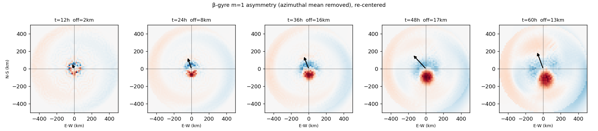

# Draft subsection — track-error characterization

*Drop-in for the Results (or a standalone "Error characterization" subsection). Prose is
manuscript-register; the bracketed author notes at the end are for you, not the paper.
**Reframed 2026-06-23** to the two-contribution structure after the six-storm validation
([SIX_STORM_VALIDATION_NOTE.md]) and the β-drift projection test
([BETA_DRIFT_PROJECTION_TEST.md]): the testbed β-gyre stands as a characterized model property;
the landfall cross-track is reported as steering-controlled and not robust to storm geometry, with
the β-gyre bias a detectable but subdominant along-track term. The earlier "systematic eastward
landfall displacement" bridge is retired.*

---

Oracle's track errors are characterized at two levels, and we keep them deliberately separate. The
first is a property of the model's **self-propagation**, isolated in a quiescent-environment testbed
in which no environmental steering is imposed. The second is the **landfall track error** of six
historical storms run under a single storm-agnostic configuration. The testbed isolates a clean,
bounded bias in the model's β-drift; the landfall error of any individual storm is a convolution of
that bias with environmental-steering error and unmodeled track features. As we show below, the
characterized β-gyre bias is detectable in the landfall errors — but as a subdominant contribution
to along-track timing on poleward-moving storms, **not** as the systematic cross-track displacement
that a single-source reading would predict. Landfall cross-track is set by storm-specific steering
and is not robust across storm geometry.

## An over-rotating β-gyre: a self-propagation aim error

Self-propagation by the β-effect is a first-order contributor to tropical-cyclone motion, so we
characterize the model's β-drift directly, in isolation from any imposed steering. We integrate a
single balanced vortex on a β-plane with no environmental flow and measure the β-drift vector over
the mature window (30–48 h) of the center track. In a representative mature-hurricane configuration
(maximum wind 64 m s⁻¹, environmental radius 500 km, wind-profile taper onset at 200 km, intensity
cap 70 m s⁻¹), the simulated β-drift is directed approximately 8–10° west of due north — that is,
essentially poleward with only a weak westward component — whereas the canonical β-drift of an
idealized vortex is oriented toward the northwest quadrant (Holland 1983; Chan and Williams 1987;
Fiorino and Elsberry 1989; reviewed by Chan 2005). The discrepancy is thus a *deficit in the westward
component* of self-propagation: the model reproduces a β-drift of canonical magnitude (≈2.3–2.5 m s⁻¹,
within the 1–3 m s⁻¹ range expected for β-drift; Chan 2005) but with a
westward component of only ≈0.4 m s⁻¹ — under a fifth of the total drift — leaving the
self-propagation nearly meridional rather than northwestward.

A control integration confirms that this drift is genuinely β-induced rather than a numerical or
frame artifact. Repeating the testbed on an *f*-plane — the meridional gradient of planetary
vorticity set to zero, with the same vortex, domain, operators, and time step — produces no
systematic translation: the center remains fixed to within the tracker noise floor (drift components
≲ 0.02 m s⁻¹) over the full integration, whereas restoring β recovers the ≈2.3–2.5 m s⁻¹ drift. The
self-propagation is therefore a true β-drift, and the aim residual is a property of how the model
develops the β-gyres, not an advection or center-finding bias.

To determine whether this aim residual is a tunable or numerical artifact, we tested it against the
three configuration and discretization levers that could plausibly control it.

**Outer-vortex structure.** The radius at which the outer wind profile begins to taper sets the
horizontal scale of the β-gyres and is the model's only free outer-structure parameter. In the
isolated testbed, reducing the taper-onset radius from 250 to 200 km rotates the β-drift modestly
toward the northwest. Applied to a full storm (Ivan), the same change moved the landfall position
only ~15 km — far short of the cross-track residual — with the bulk of the landfall error unchanged.
Outer structure modulates the aim slightly but does not control it; this small landfall footprint
already foreshadows the subdominance established in the six-storm audit below.

**Subgrid diffusion.** The dynamical core employs fourth-order (∇⁴) hyperdiffusion with coefficient
ν₄ = 3.0 × 10¹¹ m⁴ s⁻¹ for grid-scale noise control. We reduced ν₄ to test the hypothesis that
diffusive smearing of the β-gyre asymmetry damps the westward ventilation and so tilts the drift
poleward — under which a smaller ν₄ should rotate the aim back toward the northwest. It does not.
Reducing ν₄ to 1.0 × 10¹¹ m⁴ s⁻¹ produced grid-scale energy accumulation (the peak azimuthal wind
grew from 42 to 74 m s⁻¹ with no corresponding intensification), and on that contaminated solution
the mature aim did not rotate toward the northwest — it remained essentially meridional. Further
reduction (ν₄ ≤ 3.0 × 10¹⁰ m⁴ s⁻¹) produced outright numerical divergence. At the operating
resolution (Δx = 15.6 km) ν₄ is therefore load-bearing for numerical stability — it is removing
genuine grid-scale noise generated by the advection — and is not available as a tuning direction:
reducing it neither recovers the westward component nor preserves a clean integration. Diffusion
does not control the residual.

**Horizontal resolution.** Holding ν₄ fixed at its baseline value (which remains below the
hyperdiffusion stability limit at all grids tested) and the time step fixed at 30 s (advective
Courant number ≤ 0.27 at the finest grid, bounded by the 70 m s⁻¹ intensity cap), we refined the
horizontal grid by a factor of two, from Δx = 15.6 to 7.8 km. The mature β-drift heading is
invariant to within 2° across the refinement, while the magnitude converges monotonically (Table 1).
The aim residual is therefore not a discretization artifact: the β-gyre is adequately resolved at the
operating resolution, the drift *magnitude* is grid-converged, and additional refinement does not
rotate the aim toward the expected northwest orientation.

**Table 1.** Mature (30–48 h) β-drift in the quiescent-environment testbed as a function of
horizontal resolution, with ν₄ and Δt held fixed. Heading is measured clockwise from due north
(i.e., 350° ≈ 10° west of north); a westward rotation toward the expected northwest β-drift would
appear as a *decrease* in heading.

| Grid (n) | Δx (km) | β-drift heading | Δ vs. coarsest | β-drift speed (m s⁻¹) |
|:--------:|:-------:|:---------------:|:--------------:|:---------------------:|
|   320    |  15.6   |      350°       |       —        |         2.49          |
|   480    |  10.4   |      351°       |      +1°       |         2.39          |
|   640    |   7.8   |      352°       |      +2°       |         2.29          |

Two further diagnostics identify the mechanism as a β-gyre that over-rotates past its equilibrium
orientation rather than settling onto it. First, the anomaly is *intensity-independent* in its
cross-track-relevant component. Varying the vortex strength over a threefold range, the westward
component of the β-drift remains nearly constant at ≈0.4 m s⁻¹ — well short of the northwestward
propagation expected of canonical β-drift — while the northward component, and with it the total
drift speed, scales with maximum wind as expected. The drift vector therefore rotates poleward as
intensity increases (its mature heading shifts from ≈338° at the weakest vortex to ≈351° at the
strongest), but this reflects a growing poleward component acting over a near-fixed westward one,
not a change in the underlying anomaly: the westward component does not recover with intensity. An
aim error set by the storm's own swirl or vertical shear would scale with intensity; a westward
component that stays small regardless points instead to the β-Rossby gyre dynamics themselves.
Second, resolving the drift heading in time shows that it does not lock onto the canonical
orientation and remain there. The heading begins near northwest early in the integration and climbs
steadily poleward thereafter — by ≈14° over 48 h at the strongest vortex and ≈16° at the weakest —
so that the *rate* of this poleward precession, like the smallness of the westward component, is
insensitive to intensity. The β-gyre asymmetry continues to rotate cyclonically past the orientation
at which a correctly equilibrated gyre would balance, so that the time-mean self-propagation is aimed
too far poleward; both intensity-invariant signatures — the persistently small westward component
and the intensity-independent precession rate — point to β-Rossby gyre dynamics rather than a
swirl-driven mechanism. Figure Y shows the corresponding m = 1 vorticity asymmetry: its amplitude
saturates while its orientation holds poleward of northwest — the structural signature of this
equilibration failure.

**Figure Y.** β-gyre m = 1 vorticity asymmetry (azimuthal mean removed, vortex re-centered) at
t = 12–60 h in the quiescent-environment testbed. The asymmetry intensifies as the storm drifts; the
black arrow is the swirl-removed steering flow, which matches the simulated β-drift. The gyre
amplitude saturates while its orientation holds poleward of the canonical northwest — the structural
source of the poleward-biased self-propagation aim.

The aim residual survives all three levers: it is insensitive to outer-vortex structure, it cannot
be diffused away without loss of numerical stability, and it is invariant under a doubling of
horizontal resolution. We therefore characterize it not as a tunable bias or a discretization error
but as an intrinsic property of the model's β-gyre dynamics — a bounded, systematic poleward bias in
self-propagation aim, expressed as a deficient westward component of the β-drift, arising because the
simulated β-gyres over-rotate past their equilibrium orientation. This is a characterized **model
property**, isolated in the testbed and independent of any storm; what it does to a real landfall is
a separate, falsifiable question, addressed next.

## Landfall track errors across six storms

We evaluate the configuration against six historical landfalls — Hugo (1989), Katrina (2005),
Ivan (2004), Fran (1996), Michael (2018), and Laura (2020) — under one storm-agnostic configuration.
The configuration carries **no landfall-tuned parameter**: its single outer-structure parameter, the
β-drift taper-start radius, is calibrated in the quiescent testbed to the canonical β-drift magnitude
band (Section X, above), independent of every storm's track and landfall. All six storms are
therefore track-*validation* cases, not calibration targets. Hugo, Katrina, and Ivan are the three
storms behind the eastward cross-track cluster reported in earlier drafts; Fran, Michael, and Laura
were added to test whether that behavior generalizes to storms the model had never been run on.

We report each landfall error as an **along-track/cross-track decomposition** relative to the
observed best track, evaluated at the observed landfall fix (Table 2), and we no longer report a
single same-latitude cross-track scalar. The scalar manufactures an artifact for recurving storms:
Michael's true error is a +124 km along-track overshoot (the model runs poleward while the observed
storm recurves northeast), and because the observed motion is turning, that overshoot reprojects
onto a same-latitude axis as a spurious ~75 km of westward cross-track. The along/cross
decomposition makes the error legible as timing and removes the artifact.

**Table 2.** Landfall track error for six storms under the single storm-agnostic configuration,
decomposed relative to the observed best track at the observed landfall fix. Positive along-track =
model ahead of (earlier than) observed; positive cross-track = model to the right of (east of) the
observed track. Landfall heading is the observed storm motion, clockwise from north.

| Storm   | Role         | Along-track (km) | Cross-track (km) | Landfall heading | Translation        |
| ------- | ------------ | ---------------- | ---------------- | ---------------- | ------------------ |
| Hugo    | discovery    | +23              | +110             | ~325° (NNW–NW)   | moderate           |
| Katrina | discovery    | +77              | +125             | ~350° (N)        | moderate           |
| Ivan    | discovery    | +249             | +126             | ~340° (NNW)      | recurver           |
| Fran    | test         | −45              | +8               | ~335° (NNW)      | fast (~15 kt)      |
| Michael | test         | +124             | −99              | ~010° (N→NE)     | slow (~11 kt)      |
| Laura   | test         | +37              | −32              | ~350° (→N)       | moderate (~13 kt)  |

The three discovery storms all show a large eastward (right-of-track) cross-track, +110 to +126 km —
the same-signed cluster reported in earlier drafts. **It does not generalize.** The three test storms
show cross-track errors of +8, −99, and −32 km — two of them reversed in sign and none of comparable
magnitude. The eastward cross-track is therefore not a robust property of the model: across storm
geometries it is neither same-signed nor clustered. (Because the configuration has no landfall-tuned
parameter, this is not an in-sample/out-of-sample overfitting story; it is a statement about the
*geometry-robustness* of the error.)

The decisive evidence that landfall cross-track is steering-controlled rather than bias-controlled is
a within-pair comparison. Katrina and Laura make landfall in nearly the same location (the central
Gulf coast) on nearly the same heading (≈north), yet their cross-track errors are opposite in sign,
+125 and −32 km. A track error produced by a single self-propagation bias, projected through a common
heading, **cannot** change sign between two such storms; the difference must arise from their
differing environmental steering. Storm-specific steering, not the characterized β-gyre bias, sets
the sign of the landfall cross-track.

To test directly whether the characterized β-gyre bias is the dominant landfall-error source, we
projected the testbed aim-error vector through each storm's observed landfall motion and transit
time, predicting the along/cross split each storm would show if that bias dominated
([BETA_DRIFT_PROJECTION_TEST.md]). Because all six storms make landfall on roughly poleward headings,
and the model's self-propagation is westward-deficient (i.e. biased eastward relative to canonical),
the projection predicts an eastward cross-track for **all six** storms. It reproduces the discovery
three within ~25% and recovers the along-track of the poleward-moving storms — notably Michael's
early-arrival overshoot — but it predicts the wrong sign for every test-storm cross-track. The
characterized bias is therefore detectable in the landfall errors, but it manifests as a subdominant
contribution to along-track timing on poleward movers, not as a controlling cross-track displacement.

We accordingly report two separate facts and no bridge between them. First, the model's β-gyre
over-rotates poleward, producing a bounded, characterized self-propagation aim bias — a model
property, isolated in the testbed and independent of any storm. Second, the configuration reproduces
six historical landfalls — none of them a calibration target, since it carries no landfall-tuned
parameter — with along-track and cross-track errors of tens of kilometers and characterized timing
errors. These landfall errors are dominated by environmental-steering error and unmodeled
recurvature; the characterized β-gyre bias is a detectable but subdominant along-track term,
consistent with but not the cause of the landfall cross-track. We make no claim that the testbed bias
produces a systematic landfall cross-track displacement — the six-storm audit shows that it does not.
The empirical strength of the configuration is its **blind track skill**: with its single
outer-structure parameter calibrated to canonical β-drift rather than to any landfall, it places six
storms — three of them never previously run — within tens of kilometers cross-track, with no
landfall-fitted parameter to absorb the error. This is consistent with the study's broader
methodology, in which clean initialization is used to expose true model residuals rather than to
conceal them behind compensating errors (Section X).

---

### Author notes (delete before submission)

- **Reframe summary (2026-06-23).** This subsection was restructured from a single
  "systematic eastward landfall displacement" claim into two separable contributions: (1) the
  testbed β-gyre as a characterized model property, unchanged; (2) a six-storm landfall audit
  reported in along/cross, with the cross-track framed as steering-controlled and **not robust to
  storm geometry**, and the β-gyre bias as a detectable-but-subdominant along-track term. The driver
  was the six-storm validation (out-of-sample cross-track nulls/reverses) and the projection test
  ([BETA_DRIFT_PROJECTION_TEST.md]). The "calibration-set-only" framing was deliberately **not**
  used — "not robust to storm geometry" is the honest statement and does not depend on the
  calibration history (see next note).

- **Table 2 numbers VERIFIED 2026-06-23 against the checked-in `*_Agnostic` run logs**
  (`oracle_v8/Logs/{Storm}/{Storm}_Agnostic*.txt`). The along/cross at the observed landfall fix:
  Hugo +23.3/+110.2 (t+28.0h), Katrina +76.5/+124.6 (t+35.2h), Ivan +249.3/+126.3 (t+42.8h),
  Fran −45.5/+7.7 (t+24.5h), Michael +123.8/−98.7 (t+29.5h), Laura +37.4/−31.9 (t+24.0h). Table 2
  rounds these. Note the landfall times for Fran/Michael/Laura are ~24.5/29.5/24 h — shorter than
  the 28/36/30 h first estimated; the projection table in [BETA_DRIFT_PROJECTION_TEST.md] was
  corrected to the log-firm transit times (signs/conclusions unchanged; Michael's predicted
  along-track tightened to +123 vs observed +124). Headings confirmed by the author (2026-06-23).

- **Calibration-history linchpin — RESOLVED 2026-06-24 (code-verified).** The single outer-structure
  parameter (taper-start = 200 km) is calibrated to the **testbed β-drift**, not to any landfall. The
  gate-beta sweep (`run_translation_test.gate_beta_only`) scores the model's β-drift against the
  canonical theory band — |drift| 1.5–2.5 m/s, heading 290–335° NW (Fiorino & Elsberry 1989) — in a
  quiescent β-plane with zero background, no ERA5 steering, and no storm; 200 km is "the in-band
  point that maximizes the westward component before the core limit" (`legacy/run_katrina.py:124`).
  `storm_data.py:26` records the discipline ("Parameters MUST NOT be retuned after seeing landfall
  errors"), and there is no optimizer/fit against landfall anywhere in the code. The stale comment
  `# the calibrated landfall value` at `production_config.py:31` (the lone dissenting artifact) was
  corrected. **Consequence:** the configuration has no landfall-tuned parameter, so all six storms
  are track-validation cases (relabeled discovery/test, not in/out-of-sample) and the headline is
  blind track skill, not out-of-sample tuning.
  *Draft Methods sentence:* "The model's single outer-structure parameter — the radius at which the
  outer wind profile begins to taper, 200 km — was calibrated in a quiescent β-plane testbed to place
  the simulated β-drift magnitude within the canonical 1.5–2.5 m s⁻¹ range (Fiorino & Elsberry 1989),
  maximizing its westward component subject to the resolution limit. It was not fit to any storm's
  observed track or landfall; all six landfall comparisons are therefore validation cases."

- **Citations INSERTED 2026-06-24.** The two `[cite]` markers in the mechanism section's first
  paragraph are now filled: the canonical β-drift **direction** (NW) cites Holland 1983; Chan and
  Williams 1987; Fiorino and Elsberry 1989; reviewed by Chan 2005. The **magnitude** (1–3 m s⁻¹)
  cites Chan 2005 (the review is the natural source for a range). Both claims are deliberately kept
  to what these *accessible* sources support — direction and magnitude only.
  ⚠ **Build the bibliography from these and verify volume/pages against the originals** (drafted from
  memory — years/journals reliable, vol/pages to confirm):
  - Holland, G. J., 1983: Tropical cyclone motion: Environmental interaction plus a beta effect.
    *J. Atmos. Sci.*, **40**, 328–342.
  - Chan, J. C. L., and R. T. Williams, 1987: Analytical and numerical studies of the beta-effect in
    tropical cyclone motion. Part I: Zero mean flow. *J. Atmos. Sci.*, **44**, 1257–1265.
  - Fiorino, M., and R. L. Elsberry, 1989: Some aspects of vortex structure related to tropical
    cyclone motion. *J. Atmos. Sci.*, **46**, 975–990.
  - Chan, J. C. L., 2005: The physics of tropical cyclone motion. *Annu. Rev. Fluid Mech.*, **37**,
    99–128.
  ⚠ **Deliberately NOT cited:** any precise *canonical westward-component magnitude* or *angular
  offset*. The anomaly is framed entirely on **direction** (model nearly meridional vs. canonical NW)
  using the model's *own measured* westward component (≈0.4 m s⁻¹), which needs no external magnitude.
  If a reviewer asks for a quantitative offset, the legitimate route is to evaluate Smith's (1997,
  *Tellus*) empirical scaling law at this vortex's nondimensional parameters and derive it — a cited
  derivation, not a number lifted from a table. Optional.

- **Section X** cross-refs: (1) HURDAT2 initialization; (2) the six-storm landfall table/figure;
  (3) the compensating-errors methodology paragraph. Wire to your actual numbers.

- **The structural-init treatment is off the table.** The projection test plus the existing
  `gate-beta-renv` size response (broader vortex → stronger *and more poleward/eastward* β-drift)
  show that a storm-specific observed-structure initialization would worsen the discovery storms and
  cannot produce the test storms' westward errors. Do not write a structural-init arm into this
  subsection; see [RED_TEAM_AUDIT.md] and [BETA_DRIFT_PROJECTION_TEST.md].

- **Housekeeping (unified run audit 2026-06-20).** `run_storm.py` supplies the storm-agnostic path
  used for all storms: one production config, HURDAT2-derived storm data, geometry-derived
  domain/run length, ERA5-required steering, cooling, drag, cap, taper, and modern tracker.

- **VERIFY BEFORE PUSH (mechanism section, unchanged from prior draft):**
  - *ν₄ reduction experiment — DONE, re-run 2026-06-21, log `GATE_BETA_NU4.txt`.* 3.0e11 clean
    (heading 350°, |drift| 2.49, Vmax_end 42.2) → 1.0e11 finite but contaminated (Vmax_end 74.0;
    aim did **not** rotate toward NW — read 6°/N6°E) → 3.0e10/1.0e10/0.0 divergent (NaN).
    ⚠ **Ignore the probe's printed READ** ("Heading ROTATES NW 350→6"): angle-wraparound bug in the
    readout — 6° is *east* of north, 350→6 is +16° clockwise, the opposite of toward-NW.
  - *Table 1 — DONE, re-run 2026-06-21, log `GATE_BETA_RES.txt`.* 320→350°/2.49, 480→351°/2.39,
    640→352°/2.29. Resolution readout is the *fixed* signed-circular-delta version (no wraparound).
  - *Courant — ≤ 0.27 (cap-bounded).* Vmax_end at nx 640 = 42.0 → settled CFL ≈ 0.16; the 70 m s⁻¹
    cap bounds the worst case at 0.27.

- **Mechanism prose provenance (verify numbers/wording):**
  - *f-plane control* — β-off drift ≈ 0.02 / −0.00 / −0.01 m s⁻¹ (≈ zero); β-on true β-drift (β−f)
    ≈ 2.43 / 1.45 / 0.96 m s⁻¹ N for Vmax 64 / 35 / 21, westward 0.40 / 0.42 / 0.38 m s⁻¹.
  - *Intensity-independence* — Vmax_init 64/50/35/21 → heading 350/348/344/338°, West ≈ const 0.41,
    North ∝ Vmax. Paragraph states openly that heading rotates with intensity (338→351°) and names
    the intensity-invariant quantities as the westward component (≈0.4) and the precession rate.
  - *Time-evolution / precession* — Vmax21 heading 322/327/335/339° over t6–48 h; Vmax64 net +14°;
    rate ~Vmax-independent (+14 vs +16°).

- **Figure Y** = `gyre_precession.png` (root). If you have a per-storm β-gyre snapshot rather than
  the testbed one, swap it in.

- **Optional rigor:** if a reviewer presses on grid convergence of the *magnitude*, one more level
  (n = 960 or 1280) gives a clean Richardson extrapolation. The *heading* (the actual claim) is
  already flat across 2× and needs no further runs.
