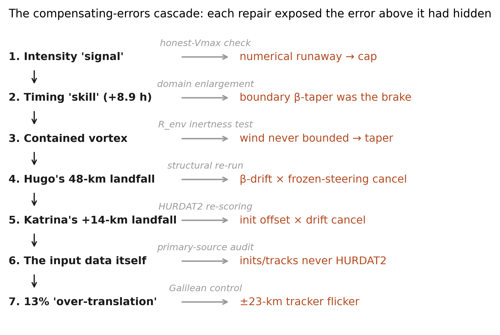
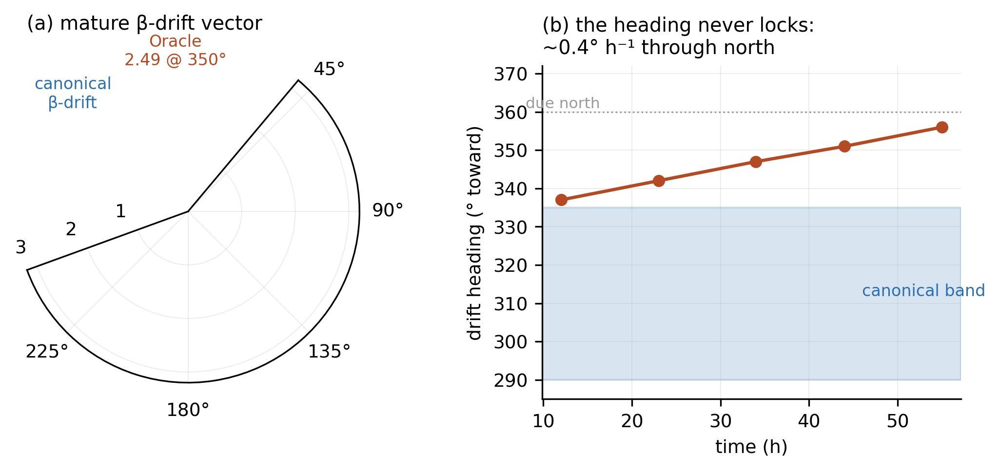
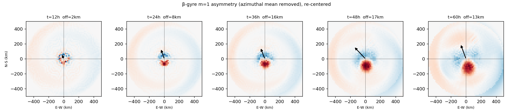
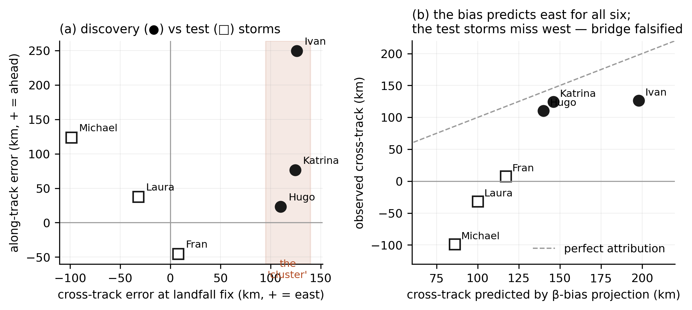

> **Capsule.** A tropical-cyclone model initialized from observations
> with no track-fitted parameter reproduces six landfalls and exposes an
> intrinsic, over-rotating $\beta$-gyre---a model error characterized in
> the open rather than hidden behind compensating fudge factors.

**Abstract.** A landfall track error convolves a storm's
self-propagation, its environmental steering, and whatever track
features a model cannot represent; landfall data alone cannot separate
them, and the standard practice of developing a model against the
hindcasts it is judged on selects for errors that cancel. We describe a
discipline, *clean initialization*, under which a tropical-cyclone
model is denied that opportunity: every storm is initialized directly
from the HURDAT2 best track, all storms run under one storm-agnostic
configuration, and the single structural free parameter is calibrated
against canonical $\beta$-drift physics in a quiescent testbed---never
against any landfall. The discipline produced two results and a
falsification. First, a characterized model property: the model's
$\beta$-gyres over-rotate, yielding self-propagation of canonical
magnitude aimed nearly due poleward, a bias that survives structure,
diffusion, and resolution levers and an $f$-plane null. Second, blind
track skill: six historical Atlantic landfalls---three never run during
development---are reproduced with cross-track errors from a few tens of
kilometers to roughly 125 km. The obvious bridge between the two
facts---that the bias causes the landfall errors---was drafted, tested
by projecting the bias through each storm's landfall geometry, and
falsified: steering controls landfall cross-track, and the bias is a
subdominant along-track term. We recount the compensating-errors
cascade the discipline exposed---seven errors, each hidden behind the
one above it---and offer the method as a template for trustworthy model
evaluation.

**Significance Statement.** Weather models are usually adjusted until
they reproduce past events---a practice that can hide errors that
happen to cancel. We built a hurricane track model that is never tuned
to observed tracks: it is initialized from the official hurricane
database, and its one structural setting is calibrated against textbook
vortex physics. Run on six historical hurricanes---three of them never
used during development---it reproduced landfall positions without any
storm-specific adjustment. Just as important, the discipline exposed a
specific, measurable error in how the model's storms steer themselves,
and a chain of hidden, compensating errors in our own physics, data,
and measurement tools that conventional tuning would have buried. We
offer the approach as a template for trustworthy model evaluation.

# Introduction

This paper reports two facts about one tropical-cyclone model---a
characterized error and a blind success---and the test that stopped us
from claiming the obvious bridge between them.

The facts concern track. A tropical cyclone's motion is, to leading
order, a superposition of two influences: *environmental steering*, the
storm carried along by the surrounding deep-layer flow, and
*self-propagation*, the storm pushing itself. The classical
self-propagation mechanism is $\beta$-drift: a vortex on the rotating
Earth organizes a pair of counter-rotating gyres out of the
planetary-vorticity gradient, and the flow between those gyres propels
the storm---canonically toward the northwest, at 1--3 m s$^{-1}$, for a
Northern Hemisphere cyclone. Neither influence is directly observable in
a track; what is observable, at the moment of landfall, is their sum.
Throughout this paper we decompose track error into components along and
across the observed track: the along-track component is a timing
error---the storm arrives early or late---while the cross-track
component displaces landfall itself, and with it every downstream
judgment that depends on where a storm comes ashore.

That decomposition names an attribution problem it cannot by itself
solve. A landfall error is a convolution of self-propagation error,
steering error, and whatever track features the model cannot represent
at all; landfall data alone cannot separate them, and a compensating
pair of errors in any two produces a small landfall miss for free. The
standard development practice---adjust the model until the hindcast
matches---is, seen from this angle, a machine for manufacturing exactly
such cancellations. Each tuning step is accepted because it reduces the
error against the cases in hand; nothing in that procedure distinguishes
a model that is right from a model whose errors have been arranged to
cancel, and the arrangement fails silently on the first storm that
breaks its geometry. Section 3 argues that this hazard is not
hypothetical: we document a cascade in our own development in which
seven successive errors---in the physics, the configuration, the input
data, and finally our measurement instruments---each hid behind a result
that looked good.

Our response is a discipline we call *clean initialization*. Every storm
is initialized directly from the HURDAT2 best track, with the
initialization values verified against the primary source file. Every
storm runs under one storm-agnostic configuration. The configuration's
single structural free parameter---the radius at which the initial
vortex's outer wind profile begins to taper---is calibrated in a
quiescent-environment testbed against the canonical $\beta$-drift range
from the published literature, never against any landfall. And residuals
are reported as findings rather than absorbed into the configuration.
The cost of this discipline is that the model misses visibly, including
in ways a tuned model would not. The payoff is that its misses mean
something---and so do its hits.

The two facts are as follows. First, clean initialization exposed a
structural error worth characterizing in its own right: the model's
$\beta$-gyres *over-rotate*. In the isolated testbed the simulated
$\beta$-drift has canonical magnitude but is aimed nearly due
poleward---its westward component is a fraction of the canonical
value---and the deficit survives every lever that could plausibly
control it: outer-vortex structure, diffusion, a doubling of horizontal
resolution, and an $f$-plane null test that rules out numerical and
tracker artifacts (Section 4.1). It is a bounded, reproducible,
mechanistically located bias in self-propagation aim, and we report it
as a model property rather than removing it. Second, the same
configuration exhibits blind track skill: six historical Atlantic
landfalls---Hugo (1989), Katrina (2005), and Ivan (2004), on which the
residual was first characterized, and Fran (1996), Michael (2018), and
Laura (2020), which the configuration had never run---are reproduced
with cross-track errors ranging from a few tens of kilometers to roughly
125 km, with no track-fitted parameter anywhere in the system (Section
4.2).

The obvious paper connects these facts: the discovery storms all landed
east of their observed tracks by a strikingly consistent
$\sim 120$ km, and an over-rotating $\beta$-gyre pushes
poleward-moving storms east. We drafted that paper. It was wrong, and
the manner of its failure is the third thing this paper reports. The
three test storms broke the cluster---two of them missed *west*---and a
projection test showed that no single self-propagation bias vector,
pushed through each storm's landfall geometry, can reproduce the six
observed errors: two storms approaching on the same heading missed on
opposite sides. Steering controls landfall cross-track in these cases;
the $\beta$-gyre bias is real, detectable---it predicts one test storm's
along-track error almost exactly---but subdominant (Section 4.2). We
therefore present the two results as two results, with the honest
relation between them, and we present the methodology that forced that
honesty---the compensating-errors cascade, the registered predictions,
the claims retired by our own probes before review---as a contribution
in its own right (Section 3), of particular relevance as model
development workflows become increasingly automated.

The remainder of the paper is organized as follows. Section 2 describes
the model---a nonhydrostatic anelastic core run, deliberately, in a
reduced barotropic configuration---and the experimental design:
initialization, the single calibrated parameter, steering, and track
verification. Section 3 presents the clean-initialization methodology
and the cascade of compensating errors it exposed. Section 4 presents
the two results: the over-rotating $\beta$-gyre as a characterized model
property (4.1) and the six-storm landfall record with its along/cross
attribution (4.2). Section 5 discusses what the over-rotation is and is
not, the limits of landfall attribution, and what blind skill under a
no-tuning discipline does and does not demonstrate. Section 6 concludes.

# Dynamical Core and Experimental Design

## Dynamical Core

Oracle V8 is a three-dimensional, nonhydrostatic dynamical core solving
the Lipps and Hemler (1982) anelastic equations---the standard
soundproof system for deep convection, in which acoustic modes are
filtered by the mass-continuity constraint
$\nabla \cdot (\bar{\rho} \mathbf{u}) = 0$ about a hydrostatic, stably
stratified base state. The prognostic variables are the three velocity
components and the potential-temperature perturbation $\theta'$;
pressure enters as the potential of a projection that enforces the
constraint. The domain is doubly periodic in the horizontal with a rigid
surface and lid, on a $\beta$-plane whose reference Coriolis parameter
is set from each storm's initialization latitude. The operating grid
spacing is $\Delta x = 15.6$ km with 32 levels over a 20-km depth, a
30-s time step, and per-storm domains of 4000--8000 km chosen by a fixed
geometric rule (Section 2.2) so that the storm's circulation never
approaches the domain edges.

One configuration choice must be stated prominently, because the results
of Section 4 are read against it. For the track experiments in this
paper, the thermodynamic pathway is switched off: $\theta'$ is zeroed at
initialization and its buoyancy forcing is not applied, so temperature
perturbations are dynamically passive and the track dynamics reduce to
vortex self-advection, the $\beta$-effect, imposed environmental
steering, and boundary-layer friction. In practice, the configuration is
barotropic---deliberately. Track at these scales is a
steering-plus-$\beta$-drift problem; running the core in its reduced
configuration makes the $\beta$-gyre characterization of Section 4.1
clean, and directly comparable to the idealized barotropic $\beta$-drift
literature (Chan and Williams 1987; Fiorino and Elsberry 1989) and to
operational barotropic track models of the BAM/VICBAR class. What
distinguishes Oracle from those models is that the reduction is a
*configuration*, not an architecture: the same core runs fully
thermodynamically active, and the anelastic system's foundational
small-perturbation assumption has been validated in that mode. The dry,
buoyancy-off track configuration is the honest minimum that the two
results of this paper require.

The remaining ingredients are the model's dissipative and bounding
operators---scale-selective $\nabla^4$ hyperdiffusion, a
vorticity-preserving divergence damper, bulk-aerodynamic surface drag,
Newtonian cooling, and an intensity ceiling. All coefficients are fixed
across every storm in this paper; none is adjusted per storm or per
landfall (Section 2.2).

::: mdframed
**Inside the Dynamical Core**

**Equations and base state.** The LH82 anelastic system prognoses
$(u, v, w, \theta')$ about a dry base state with constant buoyancy
frequency $N = 0.01\text{ s}^{-1}$
($\bar{\theta} = 300\text{ K} \cdot \exp(N^2 z/g)$; $\bar{\rho}$ from
discrete hydrostatic integration of the Exner function). Buoyancy, when
active, enters the vertical momentum equation as
$b = g \cdot \theta'/\bar{\theta}$. The equation set is implemented as a
swappable abstraction---the pseudo-incompressible system of Durran
(1989) is the designed alternative---so that the model can interrogate
its own foundational approximation. That approximation,
$|\theta'| \ll \bar{\theta}$, was tested directly in a buoyancy-enabled
eyewall configuration with prescribed annular heating: the terms LH82
neglects grow linearly at $\approx 0.85 \times \theta'/\bar{\theta}$ and
remain at the few-percent level for realistic eyewall amplitudes
($\theta'/\bar{\theta} \approx 4\%$), with stable integration to
$\theta'/\bar{\theta} \approx 9\%$ and no sign of qualitative breakdown.

**Grid and time stepping.** Vertical staggering is the Lorenz grid
($u, v, \theta'$, and the projection potential on level centers; $w$ on
level interfaces), with $w = 0$ at the rigid surface and lid. Horizontal
boundary conditions are periodic. Time integration is the three-stage
Runge--Kutta of Wicker and Skamarock (2002), with slow tendencies
(advection, Coriolis, drag, diffusion, damping, cooling) applied as
Strang-split half-steps around the buoyancy-driven fast stages; in the
barotropic track configuration the fast stages are dormant and each step
reduces to the split slow dynamics. Advection is second-order centered
in the advective form. The anelastic constraint is re-enforced after
every velocity-modifying substep by a projection: the
variable-coefficient Poisson problem
$\nabla \cdot (\bar{\rho} \nabla \phi) = \nabla \cdot (\bar{\rho} \mathbf{u}^*)$
is solved by 2-D FFT in the horizontal and a tridiagonal (Thomas) solve
in each wavenumber column, with Neumann conditions at surface and lid
and the gauge pinned at the mean mode. The solvability (compatibility)
residual of the singular mean mode is logged at every solve and sits at
machine precision across full multi-day integrations---a running
certificate that the projection is well posed, not merely stable.

**Stabilization and bounding operators (storm-agnostic values in
parentheses).**

- *Hyperdiffusion:* biharmonic $\nabla^4$ on momentum
  ($\nu_4 = 3 \times 10^{11}\text{ m}^4\text{ s}^{-1}$), scale-selective
  by design---its damping time is $\sim 20$ minutes at
  the $2\Delta x$ scale but $\sim$days at the vortex scale, so grid
  noise is removed without eroding the storm.

- *Divergence damping:* the divergent part of the horizontal flow is
  isolated by a Helmholtz decomposition (an FFT Poisson solve) and
  relaxed ($\epsilon = 0.5$ per half-step); because the correction is a
  pure gradient it adds exactly zero vorticity, leaving the balanced
  circulation untouched.

- *Surface drag:* bulk-aerodynamic ($C_d = 1.5 \times 10^{-3}$),
  decaying linearly to zero at $H_{bl} = 1\text{ km}$.

- *Newtonian cooling:* $\theta'$ relaxation ($\tau = 30\text{ min}$)
  bounding adiabatic temperature anomalies, the standard dry-model
  surrogate for radiative equilibration (Emanuel 1986).

- *Intensity ceiling:* perturbation winds are relaxed toward a 70 m
  s$^{-1}$ cap ($\tau = 300\text{ s}$), a guard against numerical
  intensity runaway (Section 3.2, chapter 1).

The $\beta$-plane's $f(y)$ is tapered smoothly back to $f_0$ over the
outer 20% of the domain at the north and south boundaries so that $f$ is
continuous across the periodic seam; the interior 60% is an exact
$\beta$-plane, and the domain rule of Section 2.2 keeps every storm
inside it. Coriolis, drag, and the intensity cap all act on the
*departure* of the wind from the imposed environmental steering flow,
which is treated as a maintained geostrophic background.
:::

## Vortex Initialization and the Single Structural Parameter

Every storm is initialized directly from the HURDAT2 best-track file
(Landsea and Franklin 2013) at the chosen initialization time. Position, maximum wind, central
pressure, and the Coriolis parameter (set from the initialization
latitude) are read from the $t = 0$ fix by the loader---no
initialization value is hand-entered---and the verification reference is
simply every subsequent best-track fix (Section 2.4). The file itself,
and our reading of it, were verified against the current and prior
HURDAT2 editions; Section 3.2 recounts what that verification caught.

The initial vortex is a Holland (1980) gradient-wind-balanced cyclone,
$V(r) = V_{\text{max}} (R_{\text{max}}/r)^B \exp[1 - (R_{\text{max}}/r)^B]$,
with the observed maximum wind, a shape parameter $B = 1.5$ frozen
across all storms, and $R_{\text{max}}$ fixed at 75 km for every
storm---a documented resolution floor ($\approx 5\Delta x$ at the
operating grid spacing), not observed inner-core structure. The profile
decays exponentially with height from its surface reference; pressure
follows from gradient-wind balance, integrated inward from the
environmental radius. (The associated warm-core temperature perturbation
is then zeroed, per the barotropic configuration of Section 2.1). Five
projection-only iterations remove residual initialization divergence
before the integration clock starts.

Left untreated, the Holland profile decays so slowly with radius
($r^{-B/2}$) that the circulation fills any domain, and the storm's
$\beta$-drift inflates accordingly (Section 3.2, chapter 3). The outer
wind is therefore tapered to zero by a cosine ramp beginning at the
*taper-onset radius* and completing at the environmental radius
$R_{\text{env}} = 500\text{ km}$. The taper-onset radius is the
configuration's **single structural free parameter**---and the sweeps
show the two nominal knobs are degenerate (only the product of
$R_{\text{env}}$ and the onset fraction matters), so it is genuinely one
parameter, not two. It was calibrated in the quiescent-environment
testbed of Section 4.1: sweeping the onset radius moves the simulated
$\beta$-drift magnitude and aim together, and an onset radius of 200 km
($\approx 2.7 R_{\text{max}}$) brings the drift magnitude into the
canonical published range while minimizing the poleward aim bias. That
value was locked before any production storm run and shared by every
storm in this paper. We emphasize the resulting property on which the
"blind" in blind track skill rests: **no parameter anywhere in the
system has ever been adjusted against a landfall**. The calibration
target is idealized-vortex physics from the literature, and no
landfall-fitting pathway exists in the code.

Domain size and run length are likewise derived, not chosen: a fixed
geometric rule takes each storm's initialization and threshold latitudes
and returns the smallest standard domain (4000--8000 km; 256--512 grid
points at fixed $\Delta x$) that keeps the storm's full circulation,
with margin, inside the exact-$\beta$ interior of Section 2.1's tapered
$\beta$-plane; integrations run 10 h past the observed landfall time.

## Environmental Steering

The environment is imposed as a horizontally uniform background flow
relaxed toward the ERA5 (Hersbach et al. 2020) deep-layer mean
(DLM)---the mass-weighted
850/700/500/300-hPa average, the standard tropical-cyclone steering
layer---computed on the raw ERA5 grid and averaged over a 3--7$^\circ$
annulus centered on the *model* storm, so that the inner core's own
circulation does not steer it. The annulus is sampled at the model's
position and interpolated in time: the storm feels the environment where
it actually is, not where the observed storm was. Every 30 minutes of
simulation the background flow relaxes toward the locally sampled DLM
with a 3-h timescale; each increment is applied simultaneously to the
flow carried in the model state and to the perturbation references of
the Coriolis, drag, and intensity-cap operators (the
perturbation-relative convention of Section 2.1), so the forcing
operators and the flow they reference advance in lockstep. Because the
increment is horizontally uniform it carries no divergence and no
vorticity: the projection, and the vortex itself, are untouched by
construction. Time-varying steering is architecture here, not
refinement: in a configuration accident that became an informative A/B
test, steering frozen at its initial value failed in *opposite*
directions on different storms (+182 km east on Hugo, $-192$ km west on
Ivan), which no steering-independent mechanism can produce. One honest
limitation is deferred to Section 5: the annulus average is not a
storm-removed environmental field, and at these radii it retains some
storm-induced flow.

## Track Verification

All track scoring passes through one shared verification module, against
the HURDAT2 fixes, in two layers. The first is the headline
same-latitude threshold comparison: the model's and the observed track's
first northward crossings of a threshold latitude (the observed landfall
latitude) are interpolated, and the crossing-time difference and the
longitude offset at crossing separate timing from cross-track
displacement. The second is the full along/cross decomposition evaluated
at every observed fix: the along-track component is the model's
displacement ahead of (or behind) the observed storm along its
instantaneous direction of motion, and the cross-track component is the
displacement to the right of that motion---approximately eastward for
the poleward-moving storms considered here. Two retired metrics motivate
this convention. The legacy landfall-point comparison---model threshold
crossing versus the observed landfall point---folds the observed storm's
remaining along-track travel into apparent cross-track error and
overstated one re-scored run by half. And any single cross-track scalar
can manufacture error for a storm that is not moving due north at
threshold: Michael's poleward along-track overshoot against an observed
track recurving northeast projects onto the same-latitude axis as a
spurious *westward* miss, which the full decomposition correctly renders
as timing (Sections 3.3, 4.2). Section 4 therefore reports both layers
for all six storms.

# Clean Initialization and the Compensating-Errors Cascade

## The Principle

A landfall hindcast can be right for the wrong reasons. A storm's track
error at landfall is a convolution of at least three sources---the
storm's self-propagation, the imposed environmental steering, and track
features the model cannot represent---and a pair of compensating errors
in any two of them will produce a small landfall miss for free. Worse,
when a model is developed against the same landfalls it is judged on,
such cancellations are not merely possible but *selected for*: every
tuning step migrates the configuration toward settings where errors
offset, and the model's failure is silently deferred to the first storm
where the cancellation does not hold. Nothing in the final error
statistics distinguishes a model that is right from one whose errors are
balanced.

We therefore adopted a discipline we call *clean initialization*:

- Every storm is initialized directly from the HURDAT2 best track, with
  the initialization values themselves verified against the primary
  source file.

- All storms run under one storm-agnostic configuration, with no
  per-storm adjustments of any kind.

- The configuration's single structural free parameter---the radius at
  which the outer wind profile begins to taper---is calibrated in a
  quiescent-environment testbed against the canonical $\beta$-drift
  range from the published literature (Section 2.2), never against any
  landfall.

- Residuals are reported as findings, not absorbed into the
  configuration.

Under this discipline the model has nowhere to hide an error. The
corollary, which this section illustrates, is that development proceeds
by *exposing* errors---including several that flattering early results
had concealed, and several introduced by our own tooling and data
handling.

## The Cascade

It is one thing to state the hazard of compensating errors and another
to watch it operate. The model's development ran as a cascade: seven
times, repairing one error exposed the next error it had been hiding. We
recount the sequence because the sequence is the point---no single
audit, however careful, would have found the seventh error while the
first six stood in front of it.

1.  **A numerical intensity runaway.** Early integrations developed
    grid-scale perturbation winds exceeding 150 m s$^{-1}$---numerical
    growth, not intensification. A bounded relaxation toward a 70 m
    s$^{-1}$ ceiling contained it, and simulated intensities became
    honest. Only then was the track readable at all.

2.  **A domain boundary acting as a brake.** With intensity honest, the
    storm arrived hours late (+8.9 h). The cause was geometric: the
    vortex was feeling the domain-edge zones where the $\beta$-plane
    approximation is tapered off. Enlarging the domain removed the
    brake---and the storm now arrived hours *early*. The lateness had
    been masking an overshoot.

3.  **A vortex with no outer edge.** The overshoot traced to vortex
    structure. The analytic wind profile used at initialization decays
    so slowly with radius that, untruncated, it filled the entire
    domain; the nominal environmental radius shaped only a dynamically
    passive pressure integral. The oversized circulation inflated the
    storm's $\beta$-drift. A cosine taper on the outer wind fixed
    this---and, in doing so, created the model's one genuine structural
    parameter, the taper-onset radius (Section 2.2).

4.  **Our best result dissolves.** Hugo's celebrated 48-km landfall
    error---the strongest early validation---did not survive the honest
    vortex: re-run with the structural fixes, Hugo missed by +182 km
    east under the then-static steering. The 48 km had been a
    cancellation between an oversized vortex's inflated westward
    $\beta$-drift and a westward deficit in steering held frozen in
    time. The repair was time-varying environmental steering, sampled
    from ERA5 along the model's own track.

5.  **A second flattering number dissolves.** Katrina's +14-km landfall
    error repeated the archetype. Scored against verified best-track
    data, the initialization had placed the storm 98 km west of its true
    track; an eastward drift of $\sim 1$ m s$^{-1}$ then
    crossed the observed track at $t \approx 21$ h, and the two errors
    near-cancelled at the landfall hour. Two errors, one flattering
    number---found only because the reference data themselves were
    re-verified (chapter 6).

6.  **The data layer itself.** Executing the verification that the
    initialization module's own documentation demanded revealed that the
    stored initialization values matched no fix in the HURDAT2 file:
    positions matching time-shifted interpolants (one a +4.2-h
    along-track head start), intensities taken from fixes twelve hours
    later, central pressures matching nothing, one storm filed under the
    wrong cyclone identifier---and the pipeline's "observed" reference
    tracks were synthetic, one of them literally a straight line from
    the (incorrect) initialization point to landfall. The provenance
    pattern---plausible, internally consistent, and wrong---is
    characteristic of values recalled from memory rather than read from
    the source. Every downstream score had inherited these references.
    All initializations and reference tracks were re-derived from the
    primary file, and the affected results re-scored or retracted
    (§3.3).

7.  **The instruments.** An apparent 13% over-translation---the model
    seemingly outrunning its own imposed steering---launched the longest
    hunt of the project, through the advection scheme, the pressure
    solver, and the damping operators. A Galilean control finally ended
    it: a balanced vortex in a uniform background flow, which must
    translate exactly with the flow, instead *appeared* to
    jitter---because the vortex center-finder reported grid-snapped
    positions with a $\pm 1.5$-cell ($\pm 23$ km) flicker, a noise floor beneath which
    the entire family of over-translation measurements had been made.
    With sub-cell center-finding the control translates faithfully to
    within 1%, even while self-intensifying, and every over-translation
    number was retired as instrument artifact. The model's advection had
    been faithful all along; the residual that remained, after the
    instrument was fixed, was the genuine $\beta$-drift signal of
    Section 4.1.

The cascade descended through four strata (Fig. 1): model physics (1),
configuration geometry (2, 3), the data layer (5, 6), and finally the
measurement instruments themselves (7). Each error was invisible while
the ones above it stood. One chapter also ended differently from the
others: the outer-wind taper that repaired chapter 3 turned out to
*mis-calibrate* the $\beta$-drift---too strong and aimed too far
poleward---which is not a bug but a physics trade-off, and it was
resolved not by tuning to landfall but by calibrating the taper-onset
radius against the canonical $\beta$-drift band in the testbed (Section
2.2). What remained after that calibration is the bounded, characterized
aim residual reported as Result 1 (Section 4.1).

**Fig. 1.** The compensating-errors cascade of Section 3.2. Each row is
a result that looked good (left), the probe that ended it (arrow
label), and the error the result had been hiding (right); repairing
each exposed the next. The strata descend from model physics through
configuration geometry and the data layer to the measurement
instruments themselves.

## The Probes: Retiring Our Own Claims

Clean initialization removes the temptation to tune; it does not by
itself protect against over-interpretation. For that we relied on a
second habit: subjecting each claim to the cheapest test that could kill
it, and registering predictions before runs rather than after. Several
claims did not survive, and their retirements shaped the paper more than
the results that stood.

**Registered predictions.** Before re-running the storms with corrected
initializations (chapter 6 above), we wrote down predicted landfall
bands---Katrina +80 to +130 km east, Hugo +90 to +130 km east---derived
from the decomposed error budget, so that the re-runs could confirm or
refute the budget rather than merely produce new numbers. Both re-runs
landed inside their bands. The residual they exposed was real,
coherent---and, as it later proved, still misattributed (below).

**Small retractions.** An early "13% over-translation" was contaminated
by a rotating-frame subtlety in the test harness (an unreferenced
background flow undergoes inertial oscillation) before being retired
altogether by the Galilean control of chapter 7. A "delayed-onset drift"
finding was retracted when re-scored against verified best-track
references: the onset had been an artifact of the synthetic reference
track, and the drift is in fact steady. An automated sweep-reader once
reported a heading change from 350$^\circ$ to 6$^\circ$ as a rotation
*toward the northwest*; 6$^\circ$ is east of north. Each of these is
small; each would have survived into review unkilled if the claim had
not been re-derived from primary data.

**The f-plane null.** The characterized self-propagation bias (Section
4.1) rests on a control: with the planetary-vorticity gradient set to
zero and all else identical, the vortex does not translate at all
(residual drift $\lesssim 0.02\text{ m s}^{-1}$). The drift is genuine
$\beta$-gyre dynamics, not an advection or tracker bias---the instrument
fix of chapter 7 made this null test meaningful.

**The two large retirements.** The first concerned our own headline. The
three discovery storms (Hugo, Katrina, Ivan) showed a tight, same-signed
eastward cross-track cluster at landfall, and the manuscript draft
claimed it as systematic. Three test storms the configuration had never
run---Fran, Michael, and Laura---answered: +8, $-99$, and $-32$ km. The
cluster was a property of the discovery set, and the claim was retired
(Section 4.2). The second concerned the bridge between our two results.
If the testbed $\beta$-gyre bias were the dominant source of landfall
cross-track error, a single bias vector projected through each storm's
landfall geometry should reproduce all six observed errors---a
one-afternoon calculation. It fails decisively: it predicts eastward
cross-track for every poleward-moving storm, whereas Katrina and Laura
approach on the same heading with opposite observed signs (+125 vs $-32$
km)---no geometry-projected vector can do that. The same test shows
where the bias *does* live: it predicts Michael's along-track error
almost exactly (+123 predicted, +124 observed). Steering controls
landfall cross-track; the $\beta$-gyre bias is real but subdominant,
expressed mainly as along-track error on poleward movers (Section 4.2).
This cheap test also cancelled an expensive plan: a data-informed
vortex-structure initialization scheme, motivated by the bridge claim,
was abandoned when the model's own structure sweeps showed it would push
every discovery storm *further* east---the wrong direction.

What this discipline buys is stated most honestly in the negative. The
results of Section 4 are not the claims we set out to make; they are the
claims that survived. A characterized self-propagation bias whose
landfall footprint is bounded and subdominant, and blind track skill
under a configuration with no landfall-tuned parameter, are what
remained after the cluster claim, the bridge claim, the over-translation
family, and two flattering landfall errors were retired by our own
tests. We offer the cascade and the probes as the methodological content
of this paper: not that the model is right, but that its errors are
where we say they are.

# Results

Oracle's track errors are characterized at two levels, and we keep them
deliberately separate. The first is a property of the model's
*self-propagation*, isolated in a quiescent-environment testbed in
which no environmental steering is imposed. The second is the *landfall
track error* of six historical storms run under a single storm-agnostic
configuration. The testbed isolates a clean, bounded bias in the
model's $\beta$-drift; the landfall error of any individual storm is a
convolution of that bias with environmental-steering error and
unmodeled track features. As we show below, the characterized
$\beta$-gyre bias is detectable in the landfall errors---but as a
subdominant contribution to along-track timing on poleward-moving
storms, *not* as the systematic cross-track displacement that a
single-source reading would predict. Landfall cross-track is set by
storm-specific steering and is not robust across storm geometry.

## An Over-Rotating $\beta$-Gyre: A Self-Propagation Aim Error

Self-propagation by the $\beta$-effect is a first-order contributor to
tropical-cyclone motion, so we characterize the model's $\beta$-drift
directly, in isolation from any imposed steering. We integrate a single
balanced vortex on a $\beta$-plane with no environmental flow and
measure the $\beta$-drift vector over the mature window (30--48 h) of
the center track. In a representative mature-hurricane configuration
(maximum wind 64 m s$^{-1}$, environmental radius 500 km, wind-profile
taper onset at 200 km, intensity cap 70 m s$^{-1}$), the simulated
$\beta$-drift is directed approximately 8--10$^\circ$ west of due
north---that is, essentially poleward with only a weak westward
component---whereas the canonical $\beta$-drift of an idealized vortex
is oriented toward the northwest quadrant (Holland 1983; Chan and
Williams 1987; Fiorino and Elsberry 1989; reviewed by Chan 2005). The
discrepancy is thus a *deficit in the westward component* of
self-propagation: the model reproduces a $\beta$-drift of canonical
magnitude ($\approx 2.3$--2.5 m s$^{-1}$, within the 1--3 m s$^{-1}$
range expected for $\beta$-drift; Chan 2005) but with a westward
component of only $\approx 0.4$ m s$^{-1}$---under a fifth of the total
drift---leaving the self-propagation nearly meridional rather than
northwestward (Fig. 2a).

A control integration confirms that this drift is genuinely
$\beta$-induced rather than a numerical or frame artifact. Repeating
the testbed on an $f$-plane---the meridional gradient of planetary
vorticity set to zero, with the same vortex, domain, operators, and
time step---produces no systematic translation: the center remains
fixed to within the tracker noise floor (drift components
$\lesssim 0.02$ m s$^{-1}$) over the full integration, whereas
restoring $\beta$ recovers the $\approx 2.3$--2.5 m s$^{-1}$ drift. The
self-propagation is therefore a true $\beta$-drift, and the aim
residual is a property of how the model develops the $\beta$-gyres, not
an advection or center-finding bias.

To determine whether this aim residual is a tunable or numerical
artifact, we tested it against the three configuration and
discretization levers that could plausibly control it.

*Outer-vortex structure.* The radius at which the outer wind profile
begins to taper sets the horizontal scale of the $\beta$-gyres and is
the model's only free outer-structure parameter. In the isolated
testbed, reducing the taper-onset radius from 250 to 200 km rotates the
$\beta$-drift modestly toward the northwest. Applied to a full storm
(Ivan), the same change moved the landfall position only $\sim 15$
km---far short of the cross-track residual---with the bulk of the
landfall error unchanged. Outer structure modulates the aim slightly
but does not control it; this small landfall footprint already
foreshadows the subdominance established in the six-storm audit below.

*Subgrid diffusion.* The dynamical core employs fourth-order
($\nabla^4$) hyperdiffusion with coefficient
$\nu_4 = 3.0 \times 10^{11}$ m$^4$ s$^{-1}$ for grid-scale noise
control. We reduced $\nu_4$ to test the hypothesis that diffusive
smearing of the $\beta$-gyre asymmetry damps the westward ventilation
and so tilts the drift poleward---under which a smaller $\nu_4$ should
rotate the aim back toward the northwest. It does not. Reducing $\nu_4$
to $1.0 \times 10^{11}$ m$^4$ s$^{-1}$ produced grid-scale energy
accumulation (the peak azimuthal wind grew from 42 to 74 m s$^{-1}$
with no corresponding intensification), and on that contaminated
solution the mature aim did not rotate toward the northwest---it
remained essentially meridional. Further reduction
($\nu_4 \leq 3.0 \times 10^{10}$ m$^4$ s$^{-1}$) produced outright
numerical divergence. At the operating resolution ($\Delta x = 15.6$
km) $\nu_4$ is therefore load-bearing for numerical stability---it is
removing genuine grid-scale noise generated by the advection---and is
not available as a tuning direction: reducing it neither recovers the
westward component nor preserves a clean integration. Diffusion does
not control the residual.

*Horizontal resolution.* Holding $\nu_4$ fixed at its baseline value
(which remains below the hyperdiffusion stability limit at all grids
tested) and the time step fixed at 30 s (advective Courant number
$\leq 0.27$ at the finest grid, bounded by the 70 m s$^{-1}$ intensity
cap), we refined the horizontal grid by a factor of two, from
$\Delta x = 15.6$ to 7.8 km. The mature $\beta$-drift heading is
invariant to within 2$^\circ$ across the refinement, while the
magnitude converges monotonically (Table 1). The aim residual is
therefore not a discretization artifact: the $\beta$-gyre is adequately
resolved at the operating resolution, the drift *magnitude* is
grid-converged, and additional refinement does not rotate the aim
toward the expected northwest orientation.

**Table 1.** Mature (30--48 h) $\beta$-drift in the
quiescent-environment testbed as a function of horizontal resolution,
with $\nu_4$ and $\Delta t$ held fixed. Heading is measured clockwise
from due north (i.e., 350$^\circ$ $\approx$ 10$^\circ$ west of north);
a westward rotation toward the expected northwest $\beta$-drift would
appear as a *decrease* in heading.

| Grid ($n$) | $\Delta x$ (km) | $\beta$-drift heading | $\Delta$ vs. coarsest | $\beta$-drift speed (m s$^{-1}$) |
|:----------:|:---------------:|:---------------------:|:---------------------:|:--------------------------------:|
|    320     |      15.6       |       350$^\circ$      |          ---           |               2.49               |
|    480     |      10.4       |       351$^\circ$      |      +1$^\circ$        |               2.39               |
|    640     |       7.8       |       352$^\circ$      |      +2$^\circ$        |               2.29               |

Two further diagnostics identify the mechanism as a $\beta$-gyre that
over-rotates past its equilibrium orientation rather than settling onto
it. First, the anomaly is *intensity-independent* in its
cross-track-relevant component. Varying the vortex strength over a
threefold range, the westward component of the $\beta$-drift remains
nearly constant at $\approx 0.4$ m s$^{-1}$---well short of the
northwestward propagation expected of canonical $\beta$-drift---while
the northward component, and with it the total drift speed, scales with
maximum wind as expected. The drift vector therefore rotates poleward
as intensity increases (its mature heading shifts from
$\approx 338^\circ$ at the weakest vortex to $\approx 351^\circ$ at
the strongest), but this reflects a growing poleward component acting
over a near-fixed westward one, not a change in the underlying anomaly:
the westward component does not recover with intensity. An aim error
set by the storm's own swirl or vertical shear would scale with
intensity; a westward component that stays small regardless points
instead to the $\beta$-Rossby gyre dynamics themselves. Second,
resolving the drift heading in time shows that it does not lock onto
the canonical orientation and remain there. The heading begins near
northwest early in the integration and climbs steadily poleward
thereafter (Fig. 2b)---by $\approx 14^\circ$ over 48 h at the
strongest vortex and $\approx 16^\circ$ at the weakest---so that the
*rate* of this poleward precession, like the smallness of the westward
component, is insensitive to intensity. The $\beta$-gyre asymmetry
continues to rotate cyclonically past the orientation at which a
correctly equilibrated gyre would balance, so that the time-mean
self-propagation is aimed too far poleward; both intensity-invariant
signatures---the persistently small westward component and the
intensity-independent precession rate---point to $\beta$-Rossby gyre
dynamics rather than a swirl-driven mechanism. Figure 3 shows the
corresponding $m = 1$ vorticity asymmetry: its amplitude saturates
while its orientation holds poleward of northwest---the structural
signature of this equilibration failure.

**Fig. 2.** The testbed $\beta$-drift diagnosis. (a) The mature
(30--48 h) drift vector at the production configuration: canonical
magnitude (2.49 m s$^{-1}$) aimed at 350$^\circ$, nearly due poleward,
against the canonical northwest $\beta$-drift band (shaded). (b) Drift
heading versus time: the heading never locks, precessing poleward at
$\approx 0.4^\circ$ h$^{-1}$ through---and past---due north; the
shaded band is the canonical range.

**Fig. 3.** $\beta$-gyre $m = 1$ vorticity asymmetry (azimuthal mean
removed, vortex re-centered) at $t$ = 12--60 h in the
quiescent-environment testbed. The asymmetry intensifies as the storm
drifts; the black arrow is the swirl-removed steering flow, which
matches the simulated $\beta$-drift. The gyre amplitude saturates while
its orientation holds poleward of the canonical northwest---the
structural signature of the equilibration failure.

The aim residual survives all three levers: it is insensitive to
outer-vortex structure, it cannot be diffused away without loss of
numerical stability, and it is invariant under a doubling of horizontal
resolution. We therefore characterize it not as a tunable bias or a
discretization error but as an intrinsic property of the model's
$\beta$-gyre dynamics---a bounded, systematic poleward bias in
self-propagation aim, expressed as a deficient westward component of
the $\beta$-drift, arising because the simulated $\beta$-gyres
over-rotate past their equilibrium orientation. This is a characterized
*model property*, isolated in the testbed and independent of any storm;
what it does to a real landfall is a separate, falsifiable question,
addressed next.

## Landfall Track Errors Across Six Storms

We evaluate the configuration against six historical landfalls---Hugo
(1989), Katrina (2005), Ivan (2004), Fran (1996), Michael (2018), and
Laura (2020)---under one storm-agnostic configuration. The
configuration carries *no landfall-tuned parameter*: its single
outer-structure parameter, the taper-onset radius, is calibrated in the
quiescent testbed to the canonical $\beta$-drift band (Section 2.2),
independent of every storm's track and landfall. All six storms are
therefore track-*validation* cases, not calibration targets. Hugo,
Katrina, and Ivan are the three discovery storms behind the eastward
cross-track cluster whose retirement Section 3.3 recounts; Fran,
Michael, and Laura were added to test whether that behavior generalizes
to storms the model had never been run on.

We report both verification layers of Section 2.4 for every storm
(Table 2): the along-track/cross-track decomposition relative to the
observed best track, evaluated at the observed landfall fix, and the
same-latitude threshold comparison. The decomposition is the
authoritative cross-track reading. Michael illustrates why: its true
error is a +124-km along-track overshoot (the model runs poleward while
the observed storm recurves northeast), and because the observed motion
is turning, that overshoot reprojects onto the same-latitude axis as a
spurious $\sim 75$ km of westward cross-track. The decomposition renders
the error legible as timing and removes the artifact.

**Table 2.** Landfall track error for six storms under the single
storm-agnostic configuration. Along-track/cross-track components are
evaluated at the observed landfall fix (positive along-track = model
ahead of observed; positive cross-track = model to the right of, i.e.
approximately east of, the observed track). The same-latitude layer
reports the longitude offset and crossing-time difference at the
observed landfall latitude. Landfall heading is the observed storm
motion, clockwise from north.

| Storm   | Role      | Along (km) | Cross (km) | Same-lat offset (km) | Crossing $\Delta t$ (h) | Heading | Translation |
|---------|-----------|:----------:|:----------:|:--------------------:|:----------------------:|:-------:|-------------|
| Hugo    | discovery |    +23     |    +110    |         +103         |          $-2.3$         | $\sim 325^\circ$ | moderate |
| Katrina | discovery |    +77     |    +125    |         +114         |          $-2.6$         | $\sim 350^\circ$ | moderate |
| Ivan    | discovery |    +249    |    +126    |         +68          |          $-8.1$         | $\sim 340^\circ$ | recurver |
| Fran    | test      |    $-45$   |     +8     |         +23          |          +1.2           | $\sim 335^\circ$ | fast ($\sim 15$ kt) |
| Michael | test      |    +124    |    $-99$   |         $-75$        |          $-5.2$         | $\sim 010^\circ$ | slow ($\sim 11$ kt) |
| Laura   | test      |    +37     |    $-32$   |         $-39$        |          $-1.3$         | $\sim 350^\circ$ | moderate ($\sim 13$ kt) |

The three discovery storms all show a large eastward (right-of-track)
cross-track error, +110 to +126 km---the tight, same-signed cluster of
Section 3.3. *It does not generalize* (Fig. 4a). The three test storms
show cross-track errors of +8, $-99$, and $-32$ km---two of them
reversed in sign and none of comparable magnitude. The eastward
cross-track is therefore not a robust property of the model: across
storm geometries it is neither same-signed nor clustered. (Because the
configuration has no landfall-tuned parameter, this is not an
in-sample/out-of-sample overfitting story; it is a statement about the
*geometry-robustness* of the error.)

The decisive evidence that landfall cross-track is steering-controlled
rather than bias-controlled is a within-pair comparison. Katrina and
Laura make landfall in nearly the same location (the central Gulf
coast) on nearly the same heading ($\approx$north), yet their
cross-track errors are opposite in sign, +125 and $-32$ km. A track
error produced by a single self-propagation bias, projected through a
common heading, *cannot* change sign between two such storms; the
difference must arise from their differing environmental steering.
Storm-specific steering, not the characterized $\beta$-gyre bias, sets
the sign of the landfall cross-track.

To test directly whether the characterized $\beta$-gyre bias is the
dominant landfall-error source, we projected the testbed aim-error
vector through each storm's observed landfall motion and transit time,
predicting the along/cross split each storm would show if that bias
dominated. Because all six storms make landfall on roughly poleward
headings, and the model's self-propagation is westward-deficient (i.e.,
biased eastward relative to canonical), the projection predicts an
eastward cross-track for *all six* storms (Fig. 4b). It reproduces the
discovery three within $\sim 25$% and recovers the along-track error of
the poleward-moving storms---notably Michael's early-arrival overshoot,
+123 km predicted against +124 km observed---but it predicts the wrong
sign for every test-storm cross-track. The characterized bias is
therefore detectable in the landfall errors, but it manifests as a
subdominant contribution to along-track timing on poleward movers, not
as a controlling cross-track displacement.

**Fig. 4.** The six-storm landfall record and the falsified bridge.
(a) Along-track versus cross-track error at the observed landfall fix
for the discovery (filled) and test (open) storms; the shaded band
marks the discovery storms' eastward cluster, which the test storms
break. (b) Observed cross-track error versus the cross-track predicted
by projecting the testbed $\beta$-drift bias through each storm's
landfall geometry: the projection predicts east for all six storms,
the test storms miss west or near-zero, and no single bias vector can
reproduce the record (dashed line: perfect attribution).

We accordingly report two separate facts and no bridge between them.
First, the model's $\beta$-gyre over-rotates poleward, producing a
bounded, characterized self-propagation aim bias---a model property,
isolated in the testbed and independent of any storm. Second, the
configuration reproduces six historical landfalls---none of them a
calibration target, since it carries no landfall-tuned parameter---with
along-track and cross-track errors of tens of kilometers and
characterized timing errors. These landfall errors are dominated by
environmental-steering error and unmodeled recurvature; the
characterized $\beta$-gyre bias is a detectable but subdominant
along-track term, consistent with but not the cause of the landfall
cross-track. We make no claim that the testbed bias produces a
systematic landfall cross-track displacement---the six-storm audit
shows that it does not. The empirical strength of the configuration is
its *blind track skill*: with its single outer-structure parameter
calibrated to canonical $\beta$-drift rather than to any landfall, it
places six storms---three of them never previously run---within tens
of kilometers to $\sim 125$ km cross-track, with no landfall-fitted
parameter to absorb the error. This is consistent with the study's
broader methodology, in which clean initialization is used to expose
true model residuals rather than to conceal them behind compensating
errors (Section 3).

# Discussion

## What the Over-Rotation Is---And Is Not

The testbed diagnosis of Section 4.1 can be stated in one sentence: the
model's $\beta$-gyres reach the right amplitude and the wrong
orientation, and the orientation never locks. Drift speed saturates near
the canonical magnitude while the drift heading precesses steadily
poleward through---and past---due north, at a rate insensitive to vortex
intensity. In the canonical picture, the gyre pair equilibrates where
the vortex circulation's advection of the gyres balances their
generation by the $\beta$-effect, and the storm settles onto a steady
northwestward bearing (Fiorino and Elsberry 1989; Chan and Williams
1987). In our model the amplitude side of that balance
is achieved and the phase side is not: whatever arrests the cyclonic
winding of the gyre pair in nature---and in the models that reproduce
it---is too weak here.

We know three things it is *not*. It is not an advection or measurement
artifact (the f-plane null and the validated instrument); it is not
diffusive smearing (reducing $\nu_4$ degrades the solution without
rotating the aim); and it is not under-resolution in any simple sense
(the heading is flat across a doubling of resolution). Three candidates
remained, untested at the time of this analysis, all cheap to test: the
imposed outer-wind cutoff, which sits inside the radial annulus where
the gyres live, and whose sweeps move the aim only to a floor; the
reduced barotropic configuration, since a vortex with vertical
structure disperses $\beta$-Rossby energy differently than a barotropic
one; and the specific shape---rather than the radius---of the taper. A
subsequent profile-family test has since implicated the first:
replacing the compact-support taper with a smooth outer envelope
recovers canonical, phase-locked $\beta$-drift in the testbed, and the
mechanism and its six-storm validation are reported in a companion
paper (in preparation).

## What a Landfall Can Attribute---And a Test Worth Exporting

The six-storm record enforces a discipline on attribution that we
suspect generalizes. A landfall error convolves self-propagation error,
steering error, and unrepresented track features; landfall data alone
cannot deconvolve them, and Section 4.2 shows how persuasive the
resulting illusions can be---three discovery storms produced a
16-km-tight eastward cluster that was, nonetheless, not a property of
the model. The instrument that caught this cost one afternoon: take the
candidate bias vector, project it through each storm's landfall
geometry, and demand it reproduce the held-out storms' along/cross
splits. We commend the projection test as a general gate. Any proposed
model change that is motivated by a landfall residual---a structural
initialization scheme, in our case---can be evaluated on paper against
held-out geometry before a line of it is built. Ours failed the gate;
the sweeps then showed the fix would have moved every discovery storm
the wrong way. The expensive experiment was cancelled by the cheap one,
which is the correct order.

## How Much of the Skill Belongs to the Steering?

An honest accounting of the blind track skill must start with what the
configuration is given: ERA5 is a reanalysis, so the environmental flow
the model relaxes toward is close to the truth. The skill demonstrated
here is therefore hindcast skill under near-true steering---evidence
about the *model's dynamics and the method*, not a claim of operational
forecast value, where steering must itself be forecast. Within that
frame, the attribution of Section 4.2 says the steering carries the
cross-track outcome and the model's contribution is to integrate it
faithfully while adding a bounded, characterized self-propagation.

Two cheap measurements, made after external readers pressed the point,
calibrate that statement. A persistence baseline---each storm's observed
motion at initialization, extrapolated over its transit---misses the
landfall position by more than the model on all six storms (mean total
error 225 km against the model's 132), with the deficit concentrated in
timing: every storm in this sample accelerated poleward, and persistence
cannot know that. Its cross-track error alone, however, is comparable
(117 km RMS against the model's 95), so the model's edge over a
no-skill extrapolation lives in landfall position and timing rather
than in cross-track placement---the same division of labor the
attribution asserts. And a steering-only tracer---a point advected by
the sampled annulus DLM, with no vortex at all---reproduces the
cross-track record nearly as well as the full model (105 km RMS) while
arriving late on every storm; the model runs ahead of the tracer
along-track on all six, by 104 to 261 km, which is the $\beta$-drift's
poleward push measured directly. The steering carries the cross-track;
the vortex's self-propagation carries the timing.

Two caveats on the steering pathway remain, deferred here from Section
2.3. First, the 3--7$^\circ$ annulus average is not a storm-removed
environmental field; at those radii it retains some of the storm's own
outer circulation, and the sensitivity of track to annulus width---or to
storm-removed or time-lagged steering---had not been tested at the time
of this analysis. Second, and
more subtly, a deep-layer mean drawn from reanalysis in a storm-centered
annulus may already contain part of the storm's *propagation*, not just
its environment; if so, the model's own $\beta$-drift partially
double-counts it, and the symptom would be systematic poleward
over-translation on storms whose DLM tracks their motion---a signature
at least consistent with our largest timing miss (Ivan, $-8$ h). Both
are bracketing experiments, not rebuilds; both have since been run, and
are reported in the companion paper.

## One Model, or a Class?

We do not know whether the over-rotating $\beta$-gyre is a property of
this model or of a family of models that share its
ingredients---soundproof cores, bounded vortices, hyperdiffusive
closures, or simply $\beta$-gyres asked to equilibrate at 15-km
resolution. The diagnostic, however, is portable and cheap: a quiescent
$\beta$-plane, a balanced vortex, a mature-window drift vector, and an
f-plane null. Any track model can be asked the same question in an
afternoon of compute, and the answer is a vector, not an interpretation.
We would be glad to learn whether other cores over-rotate; either answer
is informative, and the comparison would locate the mechanism faster
than we can from inside one model.

## What Blind Skill Demonstrates, and What Would Strengthen It

Six storms---three of them never run during development---are enough to
*retire* a false claim, which is the use we made of them; they are thin
support for a strong positive claim, and we state the skill accordingly.
Strengthening it is now mechanical rather than conceptual: the unified
pipeline reduces a new storm to a registry entry and a reanalysis
download, and the storms that would stress the method most are known
from the present six---more fast straight-movers and slow recurvers, and
a second basin with different climatological steering. Beyond track, the
core's thermodynamic pathway---validated but switched off throughout
this paper---is the natural frontier: with buoyancy active, intensity
becomes a prognostic quantity rather than a capped one, and the
clean-initialization discipline would face a harder test, since
intensity error and track error feed each other through exactly the kind
of compensation this paper is about. We intend to arrive at that test
with the same rule we arrived here with: the model is never granted the
benefit of the doubt.

# Conclusions

We set out to characterize a tropical-cyclone model's track error
without giving the model any opportunity to flatter us, and we report
what survived. Two facts stand. First, the model's $\beta$-gyres
over-rotate: in isolation its storms propel themselves with canonical
$\beta$-drift magnitude but nearly poleward aim, a westward deficit that
survives structure, diffusion, and resolution levers, an f-plane null,
and a validated measurement instrument. It is a bounded, reproducible,
mechanistically located model property, and we have left it in the
model, characterized rather than concealed. Second, the same
configuration---one set of coefficients, one structural parameter
calibrated to idealized-vortex physics, nothing anywhere adjusted
against a landfall---reproduces six historical landfalls, including
three storms it had never run, with cross-track errors from a few tens
of kilometers to roughly 125 km.

The relation between these facts is the caution at the center of this
paper. The obvious manuscript connects them---a poleward-biased
self-propagation pushes poleward-moving storms east, and our first three
storms all missed east by a strikingly consistent margin. That
manuscript was drafted, and it was wrong: the three test storms broke
the cluster, and a single projection calculation showed that no fixed
self-propagation bias can reproduce six landfall geometries in which two
storms on the same heading miss on opposite sides. Steering controls
landfall cross-track in these cases; the characterized bias is
detectable---it predicts the along-track error of the slowest poleward
mover almost exactly---but subdominant. We publish the two facts
separately because that is what the evidence supports, and we publish
the falsification because it is the most instructive result we have.

That instruction is the third contribution. Under clean initialization,
every flattering number we ever produced eventually dissolved into a
pair of canceling errors---seven times, in strata descending from model
physics through configuration and input data to the measurement
instruments themselves---and every dissolution was forced by a cheap,
prespecified test: registered prediction bands, primary-source
verification, null controls, a Galilean instrument check. None of this
required new theory or new computing; it required only that the model
never be granted the benefit of the doubt. A model whose errors are
characterized, bounded, and honestly placed is more useful---to
forecasters weighing its guidance, to developers hunting its next error,
and to anyone deciding how far to trust it---than a model whose errors
have been arranged to cancel. Six hurricanes suggest that standard is
attainable without sacrificing skill. We offer the discipline, as much
as the model, as this paper's contribution.

# References {.unnumbered}

<!-- AUTHOR: volumes/pages drafted from memory and NOT yet verified
against the originals — check every entry before submission. The
companion-paper entry needs its real citation once paper 2 has a
submission identity. -->

- Chan, J. C. L., 2005: The physics of tropical cyclone motion. *Annu.
  Rev. Fluid Mech.*, **37**, 99--128.
- Chan, J. C. L., and R. T. Williams, 1987: Analytical and numerical
  studies of the beta-effect in tropical cyclone motion. Part I: Zero
  mean flow. *J. Atmos. Sci.*, **44**, 1257--1265.
- Durran, D. R., 1989: Improving the anelastic approximation. *J.
  Atmos. Sci.*, **46**, 1453--1461.
- Emanuel, K. A., 1986: An air--sea interaction theory for tropical
  cyclones. Part I: Steady-state maintenance. *J. Atmos. Sci.*, **43**,
  585--605.
- Fiorino, M., and R. L. Elsberry, 1989: Some aspects of vortex
  structure related to tropical cyclone motion. *J. Atmos. Sci.*,
  **46**, 975--990.
- Hersbach, H., and Coauthors, 2020: The ERA5 global reanalysis.
  *Quart. J. Roy. Meteor. Soc.*, **146**, 1999--2049.
- Holland, G. J., 1980: An analytic model of the wind and pressure
  profiles in hurricanes. *Mon. Wea. Rev.*, **108**, 1212--1218.
- Holland, G. J., 1983: Tropical cyclone motion: Environmental
  interaction plus a beta effect. *J. Atmos. Sci.*, **40**, 328--342.
- Landsea, C. W., and J. L. Franklin, 2013: Atlantic hurricane database
  uncertainty and presentation of a new database format. *Mon. Wea.
  Rev.*, **141**, 3576--3592.
- Lipps, F. B., and R. S. Hemler, 1982: A scale analysis of deep moist
  convection and some related numerical calculations. *J. Atmos. Sci.*,
  **39**, 2192--2210.
- Wicker, L. J., and W. C. Skamarock, 2002: Time-splitting methods for
  elastic models using forward time schemes. *Mon. Wea. Rev.*, **130**,
  2088--2097.
- [Companion paper, in preparation: the compact-support mechanism, the
  envelope fix, and its six-storm validation.]
