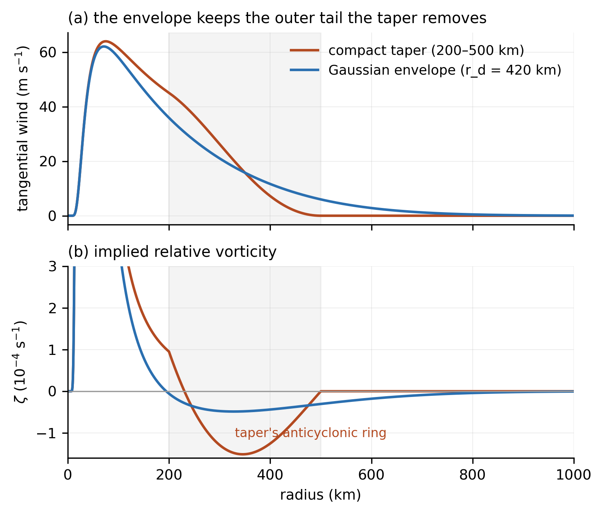
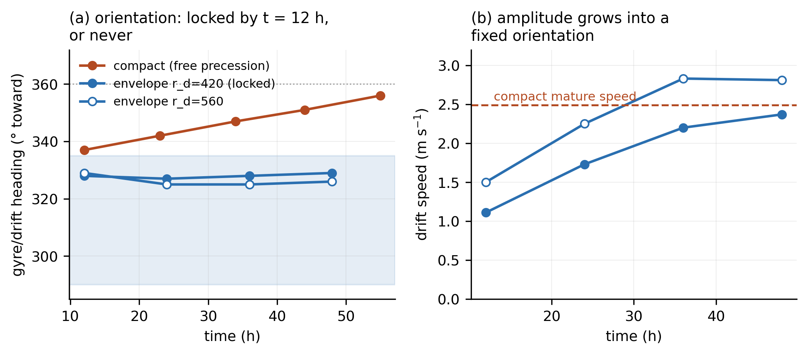
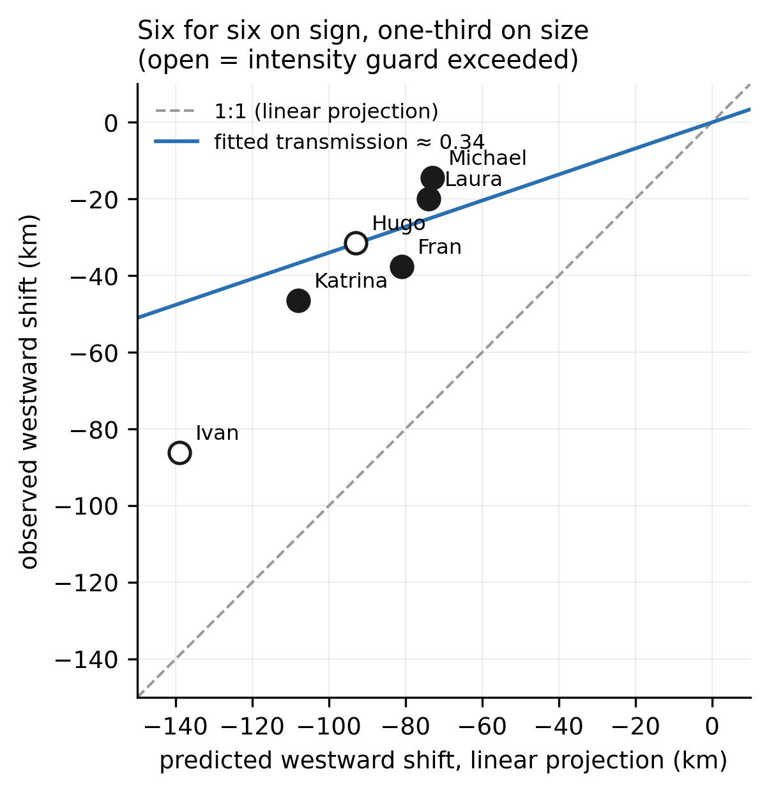
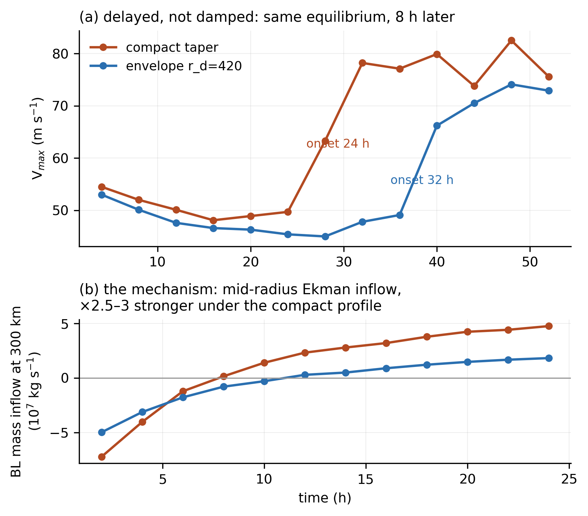

**Abstract.** A companion study characterized a persistent bias in an
idealized tropical-cyclone model's self-propagation---$\beta$-drift of
canonical magnitude aimed nearly due poleward---and showed it to be
subdominant to environmental steering at landfall, without identifying
its cause. Here we identify the cause, remove it, and measure what its
removal is worth. The bias is produced by the compact-support taper
used to bound the initial vortex: truncating the outer wind removes the
ambient flow that phase-locks the $\beta$-gyres, leaving them in free
cyclonic precession. A single-variable control isolates the cause: a
profile carrying the taper's compensating anticyclonic ring on a
retained outer tail still locks, so the failure belongs to the absent
far field, not the ring. Replacing the taper with a smooth Gaussian
envelope restores the lock---the gyre orientation is set within twelve
hours and held---and yields $\beta$-drift that is canonical in
magnitude and aim, robust across envelope scale, intensity-invariant in
direction, and null-clean on an $f$-plane. In a six-storm
reanalysis-steered A/B test conducted under predictions registered
before each run, the corrected drift shifted every storm's landfall
cross-track westward with the predicted sign, at approximately
one-third the linearly projected magnitude---an attenuation that a
direct test attributes not to steering feedback but to the gap between
mature-testbed drift and in-transit drift (intensity scaling and gyre
spin-up)---quantifying why self-propagation biases are subdominant at
landfall, and why landfall error is an unreliable instrument for
reading them. A persistence baseline and a steering-only tracer, run
under the same registered-prediction discipline, locate the skill
(steering sets cross-track, the vortex's drift sets timing, and the
model beats persistence on all six landfalls), and a three-storm blind
extension makes the sign record nine for nine while reproducing the
mechanism's per-storm predictions on straight movers---the two storms
that curve sharply into landfall under-transmit alike, a reproducible
residual we characterize rather than explain. The correction's own cost
is characterized: the envelope delays dry barotropic re-intensification
by 8--12 hours by weakening mid-radius Ekman inflow.

**Significance Statement.** Hurricane track models must represent not
only how storms are steered by their environment but how they propel
themselves. We show that a common and innocent-looking modeling
choice---truncating a simulated storm's outer winds at a fixed radius
so the vortex fits a bounded domain---silently disables the mechanism
by which the storm's self-propagation finds its correct direction,
leaving it aimed nearly due poleward. Replacing the truncation with a
smooth envelope restores textbook behavior at the cost of one line of
code. On six historical hurricanes the correction moved every landfall
in the predicted direction, but at only one-third the predicted
distance---a measured attenuation that explains why errors of this
kind hide at landfall. Any model that bounds its storms this way can
check for the artifact in an afternoon.

# Introduction

The companion paper (in preparation) reported two facts about the model
considered here and declined to bridge them: a characterized
error---the simulated $\beta$-drift, canonical in magnitude, aims
nearly due poleward, its westward component a fraction of the canonical
value---and blind track skill across six historical landfalls under a
configuration with no landfall-tuned parameter. A projection test
showed the error could not be the dominant source of landfall
cross-track error, and the paper left its *cause* as an open question
with three named candidates: the compact-support cutoff that bounds the
initial vortex's outer wind, the reduced barotropic configuration, and
the shape of the taper ramp.

This paper answers the question and follows the answer to its
consequences. The cause is the first candidate. The compact-support
taper---introduced, reasonably, to give a periodic domain a vortex of
finite size---removes the outer circulation that the $\beta$-gyres
require to phase-lock, and an unlocked gyre pair precesses freely past
its equilibrium orientation. A smooth envelope that bounds the vortex
without truncating it restores canonical behavior entirely. We then ask
what the fix is worth on real tracks, in a six-storm A/B test against
the companion paper's record, with per-storm predictions registered
before any run; the answer---every storm moves the predicted direction,
at a third of the predicted distance---measures a quantity of
independent interest, the factor by which landfall displacement
under-reads a self-propagation change, whose mechanism we then identify
by direct test. Finally, because no vortex boundary is free, we
characterize the envelope's own cost: it delays the model's dry
barotropic re-intensification, and we measure the mechanism of the
delay.

Throughout, we follow the companion paper's discipline: predictions
registered before runs, controls before claims, and failures reported
with the successes. Of thirty-two quantitative predictions registered
across the campaign, fifteen were confirmed, ten failed, and seven were
partial, unscoreable, or resolved against our stated lean; every
failure narrowed the search, and two of the failures (Sections 2 and 5)
taught us more than the confirmations did.

# Candidate Experiments

## Design

The testbed is the companion paper's: a balanced Holland vortex
(Holland 1980) on a quiescent $\beta$-plane (maximum wind 64
m s$^{-1}$, radius of maximum wind 75 km, environmental radius 500 km,
intensity cap 70 m s$^{-1}$, 320$^2$ grid points at
$\Delta x = 15.6$ km on a 5000-km domain), with the mature
$\beta$-drift vector read from the 30--48-h window. Two experimental
arms address the three candidates. Arm A varies the outer-wind profile
at fixed geometry: three compact-support ramps of increasing
smoothness---linear (slope discontinuities at both ends), the
production cosine, and a quintic smoothstep (vanishing first and second
derivatives)---plus two profiles with no compact support at all,
Gaussian envelopes $\exp(-(r/r_d)^2)$ with $r_d$ = 420 km (matched to
the production profile's wind at 350 km) and 560 km (Fig. 1). One
limit of this design is stated up front: because compact support fixes
the removed circulation, all three ramps carry an *identical
integrated ring strength* and differ only in the sharpness of the
ring's edges---so Arm A separates edge sharpness from the cutoff, not
the ring's presence from it, and a ring-carrying profile that retains
the outer tail is required to finish the attribution (Section 3). Arm
C addresses the
barotropic-configuration candidate with a baroclinicity ladder: the
balanced warm core retained and buoyancy activated, with thermal
relaxation at the production timescale, at a sixfold longer one, and
disabled.

**Fig. 1.** The two outer boundary conditions. (a) Tangential-wind
profiles of the production compact taper (cosine ramp to zero over
200--500 km; band shaded) and the Gaussian envelope ($r_d$ = 420 km),
whose wind matches the taper's at 350 km by construction: the envelope
keeps the outer tail the taper removes. (b) The implied relative
vorticity: the taper concentrates a strong anticyclonic ring inside the
ramp band; the envelope spreads a weaker, broader negative lobe and
retains far-field circulation.

The honest metric, throughout, is the westward drift component---in the
biased model it is the deficient quantity: $\approx 0.4$ m s$^{-1}$
against the $\sim 1$--2 m s$^{-1}$ implied by the canonical magnitude
and direction bands (1--3 m s$^{-1}$ toward the northwest quadrant;
Chan 2005)---and, unlike the heading, it is not
confounded by intensity---and every reading is reported against the
equilibrated maximum wind, because an earlier probe in the companion
study found aim rotations that were artifacts of vortex collapse.

## Arm A: The Cutoff, Not the Ramp

**Table 1.** Arm A: mature (30--48 h) testbed $\beta$-drift by
outer-wind profile. Heading is measured clockwise from due north;
"westward" is the westward component of the drift. $V_{\max}$ end is
the equilibrated maximum wind.

| Profile | Drift (m s$^{-1}$) | Heading | Westward (m s$^{-1}$) | $V_{\max}$ end (m s$^{-1}$) |
|---|:---:|:---:|:---:|:---:|
| linear ramp, 200--500 km | 2.19 | 348$^\circ$ | +0.47 | 42.3 |
| cosine ramp (production) | 2.49 | 350$^\circ$ | +0.42 | 42.2 |
| quintic ramp | 2.64 | 352$^\circ$ | +0.35 | 43.7 |
| Gaussian, $r_d$ = 420 km | 2.30 | **329$^\circ$** | **+1.20** | 39.7 |
| Gaussian, $r_d$ = 560 km | 2.85 | **326$^\circ$** | **+1.60** | 41.2 |

Ramp form does nothing: across a threefold change in ring sharpness the
heading spans 4$^\circ$ and the westward component 0.12 m s$^{-1}$. The
cutoff does everything: both envelopes rotate the drift
21--24$^\circ$ into the canonical northwest band (Chan 2005) and
recover a westward component of 1.2--1.6 m s$^{-1}$---three to four
times the compact family's---at essentially preserved intensity
(Table 1). Three confounds are excluded by construction. Circulation
size cannot be the driver, because the two families respond to size
with *opposite* signs (broader compact vortices drift more poleward;
broader envelopes drift more westward). Reduced mid-radius wind cannot
be, because the broader envelope carries more mid-radius wind than the
narrower one yet is more canonical, and the companion study's
onset-radius sweep---which reduces mid-radius wind directly---never
escaped its 343$^\circ$ floor. And intensity cannot be, because the
equilibrated winds differ by at most 2.5 m s$^{-1}$.

## Arm C, Reported Honestly

The baroclinicity ladder's null rungs behaved exactly (the
retained-but-passive warm core reproduced the dry control to the
tracker's precision), but its live rungs were unreadable as designed:
relaxing temperature perturbations toward zero cannot hold a *balanced*
warm core, so weakening the relaxation produced not persistent
baroclinicity but runaway adiabatic warming---95-K anomalies, far
outside the anelastic core's validated regime, with the intensity cap
engaged. The corrected design---relaxation toward the initial balanced
core---closed the runaway: the held vortex carries a bounded 45-K warm
core indefinitely, and a passive-core null reproduces the dry control
exactly. It also revealed why this candidate resists clean
adjudication: a maintained warm core is an energy source, and the
held-baroclinic vortex intensifies to the cap, entangling the aim
comparison with the known intensity dependence. Two further
compromises are named so the reading is discounted properly: the held
45-K core sits at $\theta'/\bar{\theta} \approx 15$%, a factor of 1.7
beyond the anelastic system's directly validated range
($\approx 9$%), and the model's heated secondary circulation is not
vertically converged at the production spacing (Section 6)---Arm C is
the only buoyancy-active experiment in either paper and inherits
both. The reading that survives all three is directional. With live, maintained
vertical structure, the drift moves *poleward* of the dry control
(356$^\circ$ versus 350$^\circ$; westward component 0.13 versus 0.42
m s$^{-1}$)---the wrong direction to explain the westward deficit.
Whatever maintained baroclinicity does to this core's $\beta$-gyres, it
does not supply the missing westward propagation: the candidate is
exonerated as the cause of the bias by sign, with only the magnitude of
its wrong-way nudge left entangled with intensity (Section 6).

# The Mechanism: Phase-Locking Requires the Outer Flow

The time-resolved traces make the mechanism legible (Fig. 2). Under
every compact-support profile the gyre pair reaches canonical
*amplitude*---drift speed saturates near 2.5 m s$^{-1}$---while its
*orientation* never locks: the heading precesses cyclonically at
$\approx 0.4^\circ$ h$^{-1}$, through due north and beyond, for as long
as we have integrated (60 h). Under the envelopes the orientation is
set by $t$ = 12 h, at roughly half the final amplitude, and held to
$\pm 2^\circ$ through $t$ = 48 h while the amplitude grows to
saturation (Fig. 2b).

**Fig. 2.** The phase lock. (a) Gyre/drift heading versus time: the
compact profile precesses freely through due north; both envelopes lock
by $t$ = 12 h inside the canonical band (shaded) and hold. (b) Drift
speed versus time: under the envelopes the amplitude grows into a fixed
orientation---orientation is set early, at roughly half the final
amplitude, and held while the drift matures.

In the canonical picture, the gyres equilibrate where their generation
by the $\beta$-effect balances their advection by the vortex
circulation (Fiorino and Elsberry 1989; Chan and Williams 1987), and
Fiorino and Elsberry located the controlling flow in the outer wind,
roughly 300--800 km from center (Fiorino and Elsberry 1989; Smith et
al. 1990). The compact taper amputates precisely
that band's outer half. What remains cannot advect the gyre pair into
its equilibrium orientation, and the asymmetry free-runs at something
like a $\beta$-Rossby precession rate. The "over-rotation" of the
companion paper was therefore never a rotation-rate error; it was the
absence of the arresting flow.

<!-- AUTHOR: the three citations below (Smith et al. 1990; Carr and
Elsberry 1997; Smith 1997) are newly added on external-review advice
and are UNVERIFIED — confirm titles/volumes/claims before print. -->
What is new here should be stated against a literature that is not.
That the outer wind controls $\beta$-drift is established: the
symmetric tangential wind in the 300--800-km annulus sets the gyres'
magnitude and orientation (Fiorino and Elsberry 1989; Smith et al.
1990), an empirical law gives drift direction as a function of profile
shape (Smith 1997), and Carr and Elsberry (1997) built an operational
beta-and-advection propagation model on compactly supported vortices
indexed by their cutoff radius. Prior work, that is, shows the
*equilibrium orientation shifting* with outer profile. The compact
family here shows something categorically different: no equilibrium at
all---amplitude saturates while orientation precesses freely at
$\approx 0.4^\circ$ h$^{-1}$, through due north and beyond, for as
long as we have integrated (Fig. 2a). That is a failure mode, not a
parameter dependence. How Carr and Elsberry's cutoff vortices
nonetheless yield well-defined propagation is a comparison we flag
rather than resolve---where their cutoff sits relative to the gyre
annulus, and what their closure assumes about equilibration, are the
candidate differences---and the afternoon diagnostic of Section 6
applies to their configuration as written.

The attribution Arm A could not finish, a single-variable control
does. Because compact support fixes the removed circulation, "the
cutoff" and "the compensating anticyclonic ring" are two descriptions
of the same modification everywhere in Arm A---so we built the profile
that separates them: the taper's ring ($\approx$76% of its
circulation, in the same 200--500-km band) superposed on the
envelope's retained tail, registered before the run. It **locks**:
heading steady to within 1$^\circ$ from $t$ = 24 h to 48 h at 335$^\circ$,
westward component +1.28 m s$^{-1}$---fully canonical behavior with
the ring present. The ring's whole effect is a few degrees of
equilibrium offset (335$^\circ$ against the pure envelope's
329$^\circ$)---the *parameter dependence* the prior literature
describes, and we do not press even that, since the ring-carrying
vortex equilibrates 4.8 m s$^{-1}$ hotter and the offset is
intensity-entangled (the run's registered intensity guard failed, and
is reported failed). What the guard cannot touch is the lock itself:
an orientation held for 24 hours is not an intensity artifact. The
unlock of the compact family is the absence of the arresting far
field---the cutoff, not the ring---and the exported advice is
correspondingly "keep the tail," not "relocate the ring."

The recovered drift also changes *kind*, in a way that identifies it as
canonical structure rather than a retuned artifact. In the compact
family the westward component was fixed ($\approx 0.41$ m s$^{-1}$ at
every intensity) while the northward component scaled with maximum
wind---the drift direction rotated with intensity (338$^\circ$ to
351$^\circ$ across a threefold range). In the envelope family the
direction is fixed (324--329$^\circ$ across the same range) while the
whole vector scales---which is what idealized $\beta$-drift theory
requires of a structurally set propagation. Calibration of the envelope
scale confirms the lock is not a tuning accident: across
$r_d$ = 350--560 km the heading spans 4$^\circ$ while the magnitude
ranges 1.99--2.85 m s$^{-1}$---aim and size, entangled all the way to
the compact family's floor, have decoupled. An $f$-plane null closes
the case: with $\beta$ removed the envelope vortex drifts 0.002
m s$^{-1}$, so the envelope manufactures nothing.

# The Fix and Its Calibration

The production change is one line: the outer boundary condition of the
initial vortex, from cosine-to-zero over 200--500 km to a Gaussian
envelope. The scale was frozen at $r_d$ = 420 km before any storm run,
on testbed grounds alone: its wind matches the production taper's at
350 km by construction (making the storm A/B maximally "the same
vortex, plus the tail"), its drift magnitude (2.30 m s$^{-1}$) sits
nearest the production control's 2.49, and its westward component
(+1.20) lies nearest the canonical value. The envelope's far field is
negligible where the domain requires it (0.04 m s$^{-1}$ at 1000 km at
storm intensity). How little far field the lock actually needs is
worth recording: the narrowest calibrated envelope, $r_d$ = 350 km,
locks at 330$^\circ$ while carrying 3.2 m s$^{-1}$ at 500 km and 0.4
m s$^{-1}$ at 700---the arresting flow is bought with a few meters per
second beyond the taper's own support, which sharpens the exported
diagnostic considerably. And because the envelope places real
circulation farther out than the taper, it owes the domain-geometry
check the companion paper's cascade established: on a 7500-km domain
at the same grid spacing, the envelope's drift vector moves by 0.04
m s$^{-1}$ and 2$^\circ$ (registered null)---no domain-edge
sensitivity. The no-landfall-tuning discipline of the companion
paper thus survives the model change that paper motivated: the new
parameter, like the old, has never seen a landfall.

# Six Storms, and the Transit Attenuation

## The Differential Projection

The companion paper's projection test---which falsified the
bias-explains-landfall bridge---has a better-posed differential form:
in an A/B of the *same model* under the *same* reanalysis steering
(ERA5; Hersbach et al. 2020), the steering errors cancel, and the drift
correction $\Delta = (-0.78, -0.49)$ m s$^{-1}$ (east, north),
projected through each storm's landfall geometry and transit time,
yields a per-storm predicted displacement. ($\Delta$ is a
$\Delta x$ = 15.6-km quantity: the testbed drift magnitude decreases
$\approx 8$% across a grid doubling with no demonstrated asymptote
(companion paper), and the strong-form projections and every ratio
built on them inherit that resolution dependence.) We registered those
predictions, with two hypotheses for their amplitude: H1, linear
accumulation (the strong form); H2, partial absorption by the steering
relaxation, which samples the environment at the storm's actual
position and therefore pulls a displaced storm back toward the track
the environment dictates. Guards were registered alongside: intensity
histories within $\pm 10$ m s$^{-1}$ (the envelope's re-intensification
effect, Section 5.3, was already suspected), and timing within
$\pm 3$ h on the direct-landfall storms.

## Results: The Right Sign Six Times, at a Third of the Distance

Every storm shifted westward, as predicted---discovery and test set,
fast and slow movers, straight runners and recurvers alike (Table 2,
Fig. 3).

**Table 2.** The six-storm A/B: cross-track error at the observed
landfall fix under the control (compact-taper) and envelope
configurations, the observed shift, the strong-form (linearly
projected) shift, and their ratio. Daggers mark the two
intensity-guard exceedances, excluded from the transmission estimate.

| Storm | Cross-track, control $\rightarrow$ envelope (km) | Observed $\Delta$ (km) | Strong-form $\Delta$ (km) | Ratio |
|---|:---:|:---:|:---:|:---:|
| Hugo | +110.2 $\rightarrow$ +78.7 | $-31.5$ | $-93$ | 0.34$^\dagger$ |
| Katrina | +124.6 $\rightarrow$ +78.2 | $-46.4$ | $-108$ | 0.43 |
| Ivan | +126.3 $\rightarrow$ +40.2 | $-86.1$ | $-139$ | 0.62$^\dagger$ |
| Fran | +7.7 $\rightarrow$ $-29.9$ | $-37.6$ | $-81$ | 0.46 |
| Michael | $-98.7$ $\rightarrow$ $-113.2$ | $-14.5$ | $-73$ | 0.20 |
| Laura | $-31.9$ $\rightarrow$ $-51.8$ | $-19.9$ | $-74$ | 0.27 |

The strong form failed; the attenuated form is what the storms show. On
the guard-clean storms the transmission ratio---observed shift over
linear projection---averages **0.34** (range 0.20--0.46): landfall
registered roughly one-third of the self-propagation change (Fig. 3).
Section 5.3 tests, and overturns, our registered attribution of that
attenuation. Along-track error improved on the poleward movers, where
the companion paper's projection test had located the bias's real
footprint (Katrina +76.5 $\rightarrow$ +61.4, Michael +123.8
$\rightarrow$ +93.4, Laura +37.4 $\rightarrow$ +30.0 km). The guards
did their work: two storms---Hugo and Ivan, the two with strong
re-intensification phases---ran 14 and 25 m s$^{-1}$ weaker under the
envelope, so their larger apparent gains are entangled with weakened
drift magnitude and are flagged, not claimed. The honest skill
accounting is correspondingly modest: six-storm cross-track RMS falls
from 95 to 71 km in aggregate but only from 81 to 75 km on the
guard-clean four; along-track RMS falls from 121 to 101 km.

A baseline, added when external readers asked what those numbers are
worth, calibrates them. Under predictions registered before the
calculation, a persistence forecast---each storm's observed motion at
initialization, extrapolated over its transit---was scored with the same
landfall-fix decomposition. It loses to the control configuration on
landfall position for all six storms (mean total error 225 km against
132; margins from $\times 1.1$ on Ivan to $\times 4.7$ on Laura), with
the deficit concentrated along-track: every storm in this sample
accelerated poleward, and persistence cannot know that. Its cross-track
RMS alone, however, is 117 km against the control's 95---under
near-true steering, even a no-skill extrapolation is not
catastrophically wrong about the cross-track. The registered
expectation of a more-than-twofold cross-track margin failed, and the
failure sharpens the claim: the model's edge over no-skill is landfall
position and timing; cross-track placement is largely the steering's,
which is the companion paper's attribution restated as a measurement.

**Fig. 3.** Observed westward cross-track shift versus the strong-form
(linear) projection for the six-storm A/B. Every storm moves west, as
predicted; the drawn line is the guard-clean mean transmission, 0.34
(a through-origin fit gives 0.37; dashed line: 1:1). Open symbols mark
the two intensity-guard exceedances, excluded from the estimate.

## What the Attenuation Is---and Is Not---and the Correction's Own Cost

The transmission ratio is this paper's most exportable number, and our
first attribution of it was wrong. We registered the natural hypothesis
(H2): the relaxation samples the environment at the storm's own
position, so a displaced storm feels a restoring pull. The direct test
severs that loop---steering sampled along the observed track, so that
both profiles receive an identical forcing series---and the A/B delta
barely moved: $-43$ km against $-46$ with the feedback live. Whatever
attenuates the drift correction, it is not the position feedback
(bounded below $\sim 8$% for this pair). The accounting that fits is
simpler and bias-side: the testbed characterizes the drift at mature
equilibrium and full strength, while the real storm runs weaker (the
envelope-family drift scales with intensity---a factor $\approx 0.64$
at Katrina's) and spends its first half-day spinning the gyres up
($\approx 0.65$ of the transit)---the product, $\approx 0.42$, against
Katrina's observed 0.43. Landfall reads self-propagation error at one-third
strength not because the architecture pulls the storm back, but because
a mature-testbed drift vector overstates what the drift does during a
real transit. The caution for attribution studies survives unchanged
and becomes more general, not less: landfall error under-reads
self-propagation bias by roughly a factor of three for reasons
intrinsic to how drift develops over a transit---intensity history and
gyre spin-up---not to any particular steering architecture. The number
should travel; our first attribution of it should not.

The accounting was then asked to do something harder than match a mean.
Made per-storm---the family drift-versus-intensity laws evaluated on
each run's own intensity history, under the testbed spin-up curve---it
predicts a transmission ratio for each storm, registered before
computation. Three of the four guard-clean storms land within
$\pm 0.11$ (Katrina 0.52 predicted, 0.43 observed; Fran 0.43, 0.46;
Laura 0.38, 0.27); the guard-clean means, 0.44 predicted against 0.34
observed, put the accounting 26% high in aggregate, an overshoot
driven entirely by Michael. One bookkeeping rule is worth stating in a
paper about compensating errors: a storm the guard excludes from an
estimate never reappears in that estimate's validation target. Ivan is
in no observed average above; the all-six aggregate (0.42) and the
guard-clean aggregate (0.35) are reported in the record for
completeness, and the number this paper exports is the guard-clean
mean of ratios, 0.34. It also closes the books on a flagged storm: Ivan's
outsized 0.62, which the intensity guard excluded, is predicted at 0.67
by the same accounting---the weakened envelope run's poleward deficit
projects into cross-track at Ivan's heading, so the guard removed
exactly the entanglement the decomposition now quantifies. The residual
is Michael: 0.45 predicted against 0.20 observed on cross-track, while
its along-track transmission matches the prediction (0.46 observed,
0.38 predicted). The outlier is axis-specific---Michael is the one
storm whose landfall heading makes the cross axis nearly zonal---and we
record it as unresolved rather than explained.

An independent instrument corroborates the aggregate. A steering-only
tracer---a point advected by the sampled annulus DLM, no
vortex---separates what the steering delivers from what the vortex
adds: the tracer reproduces the six-storm cross-track record nearly as
well as the full model (105 km RMS against 95) but arrives late
everywhere, the model running ahead of it along-track on all six
storms. The model-minus-tracer displacement at landfall falls within a
factor of two of the attenuated drift footprint on all four guard-clean
storms (1.2--1.7$\times$). Two instruments that share no machinery---an
A/B under identical steering, and a vortex-free integration of the
steering itself---land on the same transmission accounting.

The intensity-guard violations are not noise; they are the fix's price,
and we measured it. In the model's emergent-intensification testbed
($\beta$-plane with a steering ramp, the configuration in which this
dry model demonstrably re-intensifies), the envelope does not suppress
the re-intensification---it postpones it, by 8--12 h, to the same
capped equilibrium (onset of intensification at 24 h under the compact
profile, 32 h under the envelope; matched-time differences reach 30
m s$^{-1}$ mid-run and collapse to 3 by the end) (Fig. 4a). A
moving-frame angular-momentum budget locates the mechanism: in the
pre-onset window the boundary-layer mass inflow at 300 km runs
2.5--3$\times$ stronger under the compact profile (Fig. 4b)---Ekman
convergence scales with the surface wind the profile places at 200--400
km---while the candidate alternative (reservoir starvation) fails twice
over: the envelope vortex holds *more* total angular momentum, and
feeding the fine-grained books shows the boundary-layer import of
relative angular momentum is a net *export* until intensification
begins in either case. Hugo and Ivan, verified at fixed landfall clocks
that fall inside the delay window, read the delay as weakening. There
is no free vortex boundary: the taper's cost was aim; the envelope's is
a slower Ekman spin-up. We choose the envelope, and we report the
price.

**Fig. 4.** The envelope's cost. (a) Maximum wind in the
emergent-intensification testbed: intensification is delayed (onset
24 h $\rightarrow$ 32 h), not damped---both profiles reach the same
capped equilibrium. (b) Boundary-layer mass inflow at 300 km: in the
pre-onset window the Ekman inflow runs 2.5--3$\times$ stronger under
the compact profile---the mechanism of the delay.

## Three More Storms, Registered Blind

Because six storms carried both the skill claim and the transmission
ratio, we extended the A/B by three storms chosen for geometric
stress---predictions, guards, and thresholds frozen before any
reanalysis was downloaded. Charley (2004) lands moving
north-northeast---Michael's axis---and so asks directly whether
Michael's under-transmission is a class; its crossing of Cuba, which
the model does not represent, was registered in advance as a known
unrepresented feature. Florence (2018) lands moving nearly due west,
the record's first zonal geometry, for which the westward drift
correction should read as *timing* rather than placement. Ida (2021)
is a near-pure cross-track case beside the Katrina--Laura falsifier
pair. All guards came back clean (arm-to-arm intensity divergence
$\leq 2.6$ m s$^{-1}$, timing $\leq 0.8$ h), so every number below
counts.

**Table 3.** The three-storm extension: landfall-fix decomposition
under control and envelope, the dominant-axis shift, the strong-form
projection through the registered heading, and the observed and
decomposition-predicted transmission ratios.

| Storm | Cross, c $\rightarrow$ e (km) | Along, c $\rightarrow$ e (km) | Axis | Obs shift (km) | Strong (km) | Obs ratio | Pred ratio |
|---|:---:|:---:|:---:|:---:|:---:|:---:|:---:|
| Charley | $-31.8 \rightarrow -45.0$ | $-160.7 \rightarrow -172.8$ | cross | $-13.2$ | $-59$ | 0.22 | 0.42 |
| Florence | $+62.7 \rightarrow +65.7$ | $-124.3 \rightarrow -78.3$ | along | $+46.0$ | $+73$ | 0.63 | 0.56 |
| Ida | $+36.1 \rightarrow +13.1$ | $-14.0 \rightarrow +0.6$ | cross | $-23.0$ | $-97$ | 0.24 | 0.31 |

The sign record is now nine for nine: Charley and Ida shift westward,
and Florence shifts *forward*---its along-track shift (+46 km) dwarfs
its cross-track shift (+3 km), confirming the registered geometric
corollary that a zonal mover reads the westward correction as timing.
The blind-skill record also extends: every landfall cross-track in
the nine-storm record is within 150 km at the fix, and Ida's envelope
run lands with 13 km total error, the best in the record. (Charley's
placement holds while its timing does not---the model arrives 4--5 h
late, unable to follow the observed rapid acceleration and
intensification into landfall, with the registered Cuba crossing
unrepresented; a dry, capped model's honest limit, visible on the
axis the record says it should be visible on.)

The mechanism's first out-of-sample test splits exactly along
geometry. The per-storm decomposition, fed the new runs' intensity
histories, closes on both quasi-straight movers---Florence within
0.07, Ida within 0.07---and misses Charley by 0.20 (0.42 predicted,
0.22 observed): Michael's shortfall (0.45 predicted, 0.20 observed),
replicated under frozen predictions on the record's only other
sharply-recurving landfall. The residual is therefore a reproducible
class, not a one-off. Two candidate axes describe its membership, and
$n$ = 2 cannot separate them: both misses curve sharply into
landfall, and both carry observed inner cores far smaller than the
frozen 75-km initialization---they are the record's two most
mis-sized cores. <!-- AUTHOR: verify Michael/Charley observed RMW
against the TC reports / EBTRK before print --> One datum leans
against core size alone: Ida's observed radius of maximum wind is
19 km (HURDAT2), as mis-sized as either, and the decomposition closes
on it. The decomposition closes on every quasi-straight or zonal
mover and fails on both curved landfalls; whether curvature or
initialization is doing the work is unresolved here. A
post-hoc reading, recorded as a candidate rather than a claim: for a
sharply curving track, projecting the transit-accumulated correction
through the single final-heading geometry---as both the strong form
and the decomposition do---overstates what the correction can deliver,
and the registered [0.15, 0.55] transmission band, generalized from
cross-axis experience, likewise failed on Florence's along axis
(0.63): a long, slow transit spends more of its time at mature drift
and transmits harder. Both failures narrow the same thing---the
geometry through which a drift correction becomes a landfall
displacement---and both are recorded in the ledger.

# Discussion

**One model or a class, sharpened.** Any model that bounds its initial
vortex with compact support---a common and innocent-looking choice on
periodic domains---should check its gyre phase-lock. The diagnostic is
an afternoon: quiescent $\beta$-plane, balanced vortex, mature-window
drift vector, $f$-plane null; the signature is amplitude saturation
with heading precession. The fix costs one profile change and one
testbed calibration.

**What remains open.** The baroclinic nudge's magnitude resists
measurement: the natural matched-intensity control---a dry cap-pinned
vortex---proved unreadable when run, its track non-steady at cap
intensities (the center-finding fragility noted twice above, possibly
compounded by genuine trochoidal wobble), so the nudge's size is
recorded as unresolved while its sign already exonerates the candidate
as cause (Section 2.3). The anchoring window for a held warm core
proved narrow---sixfold weaker relaxation ends in the adiabatic
runaway---itself a datum on maintaining baroclinic structure in this
core. A wobble-robust center-tracker is the prerequisite for any future
high-intensity drift measurement. The curved-landfall
under-transmission is now a reproducible class of two: Michael (0.20
observed against 0.45 predicted) and, out of sample under frozen
predictions, Charley (0.22 against 0.42)---while the decomposition
closes on every quasi-straight or zonal mover in the record. The
leading untested candidate is the fixed-heading projection itself,
which for a sharply curving track overstates what a
transit-accumulated correction delivers to the final landfall
geometry; a curvature-following projection is a cheap next test. The environmental-sampling bracket
has been run. An annulus sweep (5--9$^\circ$ and 7--11$^\circ$ against
the production 3--7$^\circ$) found no robustness to report but
something better: the sampled poleward steering drains monotonically
with ring radius---for one storm it reverses sign---and at the widest
ring two of three storms never reach land. Combined with the structural
point that a full-ring vector mean cancels storm-centered azimuthal
structure by construction, the verdict is environmental heterogeneity
rather than storm contamination: "the environment" is not a scale-free
concept for these landfalls, and the production annulus is not one
adequate choice among many but essentially the band containing the
storm's actual advecting flow---a first-order physical choice,
validated by skill. The double-counting suspicion raised in the
companion paper is thereby bounded on both grounds, and the
obs-anchored test of Section 5.3 completes the pair.

**Instrument findings en route.** Two byproducts of the budget work
merit brief record. The bulk-drag discretization over-counted the
column-integrated momentum sink as the vertical grid refines (by
2.1$\times$ at doubled resolution; an integral-preserving form is now
available, and the production grid's effective drag coefficient is
0.75$\times$ its nominal value---a documentation correction, not a
behavioral one). And the model's heated secondary circulation is not
vertically converged at the production spacing: refinement to and
beyond doubled vertical resolution agrees to 0.1 m s$^{-1}$ while the
production grid over-produces the heated updraft by $\sim 80$%---a
characterized limitation for future thermodynamically active work (the
barotropic track configuration is untouched). Both were found because
registered predictions failed and the failures were pursued.

**The method, briefly.** Thirty-two quantitative predictions were
registered across the campaign's seven experiment sets, each committed
before the run it concerned; fifteen were confirmed, ten failed, three
held in part, three were unscoreable as designed, and one two-branch
discriminator resolved against our stated lean (the full ledger
accompanies this paper). A subsequent review-hardening round---the
persistence baseline, the steering-only tracer, and the per-storm
decomposition above---registered eleven further predictions under the
same rules (six confirmed, five failed), and the three-storm blind
extension of Section 5.4 registered five more (three confirmed, two
failed, both failures reported there). Across the program:
forty-eight registered predictions, twenty-four confirmed, seventeen
failed, seven partial or unscoreable---and the failures, throughout,
as instructive as the confirmations. The calibration record is itself informative:
the high-confidence bucket verified at seven of seven, while the middle
band ran overconfident, its misses concentrated in precisely the two
lessons recorded en route---that surface drag couples to intensity only
through a driven secondary circulation, and that threshold feedbacks
must be registered as trajectories, not endpoints. Most telling, the
two deliberate long shots---the 20%-weighted cutoff branch and the
35%-weighted attenuation branch---are this paper's two principal
results: the headline findings entered the campaign as its
least-favored registered hypotheses. The companion paper argued that a
model should never be granted the benefit of the doubt; this paper adds
the corollary that neither should the experimenter.

# Conclusions

The companion paper characterized a bias and declined to explain it;
this paper explains it, removes it, and prices both the removal and its
side effect. The poleward $\beta$-drift aim was the cost of bounding a
vortex with compact support: truncation removes the outer flow that
phase-locks the $\beta$-gyres---and by direct single-variable control,
it is the missing flow and not the taper's compensating vorticity ring
that does it. A smooth envelope restores canonical,
phase-locked, intensity-invariant self-propagation in the testbed, and
on nine historical storms---three of them added blind, under
predictions registered before their reanalysis was downloaded---moves
every landfall the predicted direction---at roughly one-third the
projected distance, because a
mature-testbed drift overstates what drift does during a real transit
(intensity history and gyre spin-up; steering feedback contributes less
than a tenth, by direct test, and a vortex-free integration of the
steering independently recovers the same footprint). That transmission
ratio, measured under registered predictions, is the mechanical content
of "subdominant to steering," and it generalizes as a caution that no longer depends on
any particular steering architecture: landfall error is a dull
instrument for reading self-propagation. The envelope's own cost---an
8--12-h delay in dry re-intensification, traced to weakened mid-radius
Ekman inflow---is characterized rather than hidden, in keeping with the
discipline both papers exist to demonstrate. The model is better than
it was, and we know exactly how much, in which respects, and at what
price.

# References {.unnumbered}

<!-- AUTHOR: volumes/pages drafted from memory and NOT yet verified
against the originals — check every entry before submission. The
companion-paper entry needs its real citation once paper 1 has a
submission identity. -->

- Chan, J. C. L., 2005: The physics of tropical cyclone motion. *Annu.
  Rev. Fluid Mech.*, **37**, 99--128.
- Chan, J. C. L., and R. T. Williams, 1987: Analytical and numerical
  studies of the beta-effect in tropical cyclone motion. Part I: Zero
  mean flow. *J. Atmos. Sci.*, **44**, 1257--1265.
- Carr, L. E., III, and R. L. Elsberry, 1997: Models of tropical
  cyclone wind distribution and beta-effect propagation for
  application to tropical cyclone track forecasting. *Mon. Wea.
  Rev.*, **125**, 3190--3209.
- Fiorino, M., and R. L. Elsberry, 1989: Some aspects of vortex
  structure related to tropical cyclone motion. *J. Atmos. Sci.*,
  **46**, 975--990.
- Smith, R. K., 1997: [AUTHOR: the *Tellus* scaling-law paper giving
  $\beta$-drift direction as an empirical function of profile
  parameters --- confirm exact title, authorship, volume, pages
  before print.] *Tellus*, **49A**.
- Smith, R. K., W. Ulrich, and G. Dietachmayer, 1990: A numerical
  study of tropical cyclone motion using a barotropic model. Part I:
  The role of vortex asymmetries. *Quart. J. Roy. Meteor. Soc.*,
  **116**, 337--362.
- Hersbach, H., and Coauthors, 2020: The ERA5 global reanalysis.
  *Quart. J. Roy. Meteor. Soc.*, **146**, 1999--2049.
- Holland, G. J., 1980: An analytic model of the wind and pressure
  profiles in hurricanes. *Mon. Wea. Rev.*, **108**, 1212--1218.
- [Companion paper, in preparation: "Catching Our Own Errors: Clean
  Initialization and Blind Track Skill in a Tropical Cyclone Model."]
